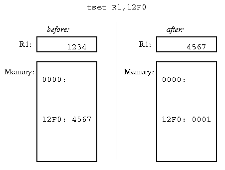

# Semaphores Implementation

* * *

Note that both OSTEP and the Silberschatz book are week on this concept.
This section of my lecture notes has more detail than normal to help you out.

Unfortunately, it is rare to find hardware that implements P & V directly
(or messages, or monitors).
They all involve some sort of scheduling and it is
not clear that scheduling stuff belongs in hardware (layering).
Thus semaphores must be built up in software using some lower-level
synchronization primitive provided by hardware.

Need a simple way of doing mutual exclusion in order
to implement P's and V's. We could use atomic reads and
writes, as in "too much milk" problem, but these are
very clumsy.

## Uniprocessor solution: Disable interrupts.

Here is a basic wait to solve the problem, but not in a very desirable way:

* * *

```
class semaphore {
    private int count;

    public semaphore (int init)
    {
        count = init;
    }

    public void P ()
    {
        while (1) {
              Disable interrupts;
              if (count > 0) {
                   count--;
                   Enable interrupts;
		   return;
              } else {
                   Enable interrupts;
              }
        }
    }

    public void V ()
    {
        Disable interrupts;
        count++;
        Enable interrupts;
    }
}

```

* * *

What is wrong with this code?

## Multiprocessor solution:

Step 1: when P fails, put process to sleep; on V just
wakeup everybody, processes all try P again.

Step 2: label each process with semaphore it's waiting for,
then just wakeup relevant processes.

Step 3: just wakeup a single process.

Step 4: add a queue of waiting processes to the semaphore.
On failed P, add to queue. On V, remove from queue.

Why can we get away with only removing one
process from queue at a time?

There are several tradeoffs implicit here: how many processes
in the system, how much queuing on semaphores, storage requirements,
etc. The most important thing is to avoid busy-waiting.

Is it "busy-waiting" if we use the solution in step 1 above?

What do we do in a multiprocessor to implement P's and V's?
Cannot just turn off interrupts to get low-level mutual exclusion.

- Turn off all other processors?

- Use atomic read and write, as in "too much milk"?


In a multiprocessor, there _must_ be busy-waiting at some
level: cannot go to sleep if do not have mutual exclusion.

Most machines provide some sort of atomic _read-modify-write_
instruction. Read existing value, store back in one atomic operation.

- E.g. Atomic increment.

- E.g. Test and set (IBM solution). Set value to one, but return
  OLD value. Use ordinary write to set back to zero.

- Read-modify-writes may be implemented directly in memory
  hardware, or in the processor by refusing
  to release the memory bus.


Using test and set for mutual exclusion:
It is like a binary semaphore in reverse, except that it
does not include waiting. 1 means someone else
is already using it, 0 means it is OK to proceed. Definition
of test and set prevents two processes from getting a 0→1
transition simultaneously.



Test and set is tricky to use, since you cannot get at it from HLLs.
Typically, use a routine written in assembler, or an HLL pragma.

Using test and set to implement semaphores:
For each semaphore, keep a test-and-set integer in addition
to the semaphore integer and the queue of waiting processes.

* * *

```
class semaphore {
    private int t;
    private int count;
    private queue q;

    public semaphore(int init)
    {
        t = 0;
        count = init;
        q = new queue();
    }

    public void P()
    {
        Disable interrupts;
        while (TAS(t) != 0) { /* just spin */ };
        if (count > 0) {
            count--;
            t = 0;
            Enable interrupts;
            return;
        }
        Add process to q;
        t = 0;
        Enable interrupts;
        Redispatch;
    }

    public V()
    {
        Disable interrupts;
        while (TAS(t) != 0) { /* just spin */ };
        if (q == empty) {
            count++;
        } else {
            Remove first process from q;
            Wake it up;
        }
        t = 0;
        Enable interrupts;
    }
}

```

* * *

Why do we still have to disable interrupts in addition to using
test and set?

Important point: implement some mechanism once, very carefully.
Then always write programs that use that mechanism. Layering is
very important.

THIS ENDS THE SECTION OF THE COURSE ON PROCESSES AND COMMUNICATION.

* * *

Copyright © 2013, 2018 Barton P. Miller

Non-University of Wisconsin students and teachers are welcome
to print these notes their personal use.
Further reproduction requires permission of the author.

