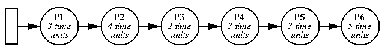
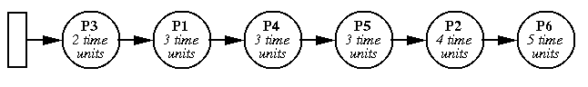
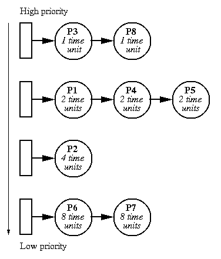

# Scheduling and CPU Scheduling

* * *

OSTEP, Chapters 7-10

## Scheduling

Until now we have talked about processes, from now on we will talk about
_resources_,
the things operated upon by processes.
Resources range from cpu time to disk space to
channel I/O time.

Resources fall into two classes:

- Preemptible: processor or I/O channel. Can take resource
   away, use it for something else, then give it back later.

Non-preemptible: once given, it cannot be reused until
 process gives it back. Examples are file space, terminal,
 and maybe memory.

OS makes two related kinds of decisions about resources:

- Allocation: who gets what. Given a set of requests for resources, which
   processes should be given which resources in order to
   make most efficient use of the resources? Implication is
   that resources are not easily preemptible.

- Scheduling: how long can they keep it.
   When more resources are requested than can be
   granted immediately, in which order should they be serviced?
   Examples are processor scheduling (one processor, many
   processes), memory scheduling in virtual
   memory systems. Implication
   is that resource is preemptible.


Resource # the processor.

* * *

## CPU Scheduling

Processes may be in any one of three general scheduling states:

- Running.
Ready. That is, waiting for CPU time. Scheduler and
 dispatcher determine
 transitions between this and running state.
- Blocked. Waiting for some other event: disk I/O, message,
   semaphore, etc. Transitions into and out of this state
   are caused by various processes.

There are two parts to CPU scheduling:

- The dispatcher provides the basic _mechanism_ for
   running processes.
- The scheduler is a piece of OS code that decides the
   _priorities_ of processes and how long each will run.

This is an example of policy/mechanism separation.

Goals for Scheduling Disciplines

- Efficiency of resource utilization
   _(keep CPU and disks busy)_.
- Minimize overhead _(context swaps)_.
- Minimize response time. (Define response time.)
- Distribute cycles equitably. What does this mean?

### Measures of Performance

There are several important ways to measure performance:

- _Response or completion time:_
   This is the amount of time until program makes an output (a "response")
   or until it complete (exits).

- _Throughput:_
   This is the number of processes that complete per unit time.
   For example, processes per second.

- _Average response or completion time:_
   Average completion time is the is the average of the completion time of
   the processes that have run in an a certain time interval.


* * *

### FCFS (also called FIFO)

Run until finished.



- In the simplest case this means uniprogramming.
- Usually, "finished" means "blocked". One process can
   use CPU while another waits on a semaphore. Go to back of run queue
   when ready.
- Problem: one process can monopolize CPU.

Solution: limit maximum amount of time that a process can
run without a context switch. This time is called a
_time slice_.

* * *

### Round Robin

Run process for one time slice, then move to back of queue.
Each process gets equal share of the CPU.
Most systems use some variant of this.
What happens if the time slice is not chosen carefully?


Originally, Unix had 1 sec. time slices. Too long. Most timesharing
systems today use time slices of 10,000 - 100,000 instructions.

Implementation of priorities: run highest priority processes
first, use round-robin among processes of equal priority. Re-insert
process in run queue behind all processes of greater or equal priority.

Even round-robin can produce bad results occasionally.
Go through example of ten processes each requiring 100 time slices.

What is the best we can do?

* * *

### STCF

Shortest time to completion first with preemption.
This minimizes the average response time.



As an example, show two processes, one doing 1 ms computation
followed by 10 ms I/O, one doing all computation. Suppose
we use 100 ms time slice: I/O process only runs at 1/10th
speed, effective I/O time is 100 ms. Suppose we use 1 ms
time slice: then compute-bound process gets interrupted
9 times unnecessarily for each valid interrupt. STCF works
quite nicely.

Unfortunately, STCF requires knowledge of
the future. Instead, we can use _past_ performance to predict
_future_ performance.

* * *

### Exponential Queue

(Also called "multi-level feedback queues".)
Attacks both efficiency and response time problems.



- Give newly runnable process a high priority and
   a very short time slice. If process uses up the time
   slice without blocking then decrease priority by 1 and
   double time slice for next time.
- Go through the above example, where the initial values
   are 1ms and priority 100.
- Techniques like this one are called _adaptive_.
   They are common in interactive systems.
- The CTSS system (MIT, early 1960's) was the first to
   use exponential queues.

Linux's new scheduler (version 2.6) makes this all very complex:

- Two queues: one with _active_ (eligible to run) processes
   and with _expired_ (not eligible to run) processes.
- 140 priority levels, but the top 100 are reserved for "real time"
   processes.
- Always choose a process from the highest non-empty priority level.
- Priority level is the sum of its _static priority_ and its
   _dynamic priority bonus_, which the scheduler assigns as an estimate of its interactivity.

 Niceness, the value that
- Static priorities range from 0-39 (number of queues) and dynamic priority bonuses range
   from -5 to +5.
- Time slices assigned based on static priority, giving higher-priority tasks larger
   time slices and lower-priority tasks shorter time slices.
- A task might not use all of its time slice at once, since it could block or be preempted
   before it finishes, but eventually it consumes the entire amount.
   When that happens, the task is usually placed on the
   expired array with a new time slice and a recalculated priority.
- An interactive task receives the same time slice as others at the same static
   priority, but the slice is divided into smaller pieces.
   When it finishes a piece, the task will round robin with other tasks at the
   same priority level.
   Execution rotates more frequently among interactive tasks of the same priority,
   but higher-priority tasks will run for longer before expiring

* * *

**Summary:**

- In principle, scheduling algorithms can be arbitrary,
   since the system should behave the same in any event.
- However, the algorithms have crucial effects on
   the behavior of the system:
  - Overhead: number of context swaps.
  - Efficiency: utilization of CPU and devices.
  - Response time: how long it takes to do something.
- The best schemes are adaptive. To do absolutely
   best, we would have to be able to predict the future.

* * *

### Priority Inversion Problem

There are some curious interactions between scheduling and synchronization.
A classic problem caused by this interaction was first observed in 1979
by Butler Lampson and David Redell at Xerox.

Suppose that you have three processes:

P1:Highest priorityP2:Medium priorityP3:Lowest priority

And suppose that you have the following critical section, S:

```
   S:  P(mutex)
       . . .
       . . .
       V(mutex)

```

The three processes execute as follows:

1. P3 enters S, locking the critical section.

2. P3 is preempted by the scheduler and P2 starts running.

3. P2 is preempted by the scheduler and P1 starts running.

4. P1 tries to enter S and is blocked at the P operation.

5. P2 starts running again, preventing P1 from running.


So, what's going wrong here?

_To really understand this situation, you should try to work out the example_
_for yourself, before continuing to read._

- As long as process P2 is running, process P3
  cannot run.

- If P3 cannot run, then it cannot leave the critical section S.

- If P3 does not leave the critical section, then P1
  cannot enter.


As a result, P2 running (at medium priority) is blocking P1
(at highest priority) from running.
This example is not an academic one.
Many designers of real-time systems, where priority can be crucial, have stumbled
over issue.
You can read the
[original paper\
by Lampson and Redell](http://www.cs.wisc.edu/~bart/736/papers/mesa.pdf)
to see their suggestion for handling the situation.
Also, do a Web search for
[priority\
inversion](http://www.google.com/search?hl=en&ie=ISO-8859-1&q=%22priority+inversion%22%22).

* * *

Copyright © 2013, 2018 Barton P. Miller

Non-University of Wisconsin students and teachers are welcome
to print these notes their personal use.
Further reproduction requires permission of the author.

