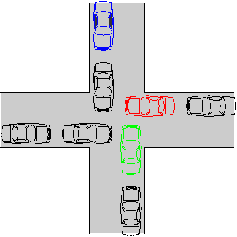
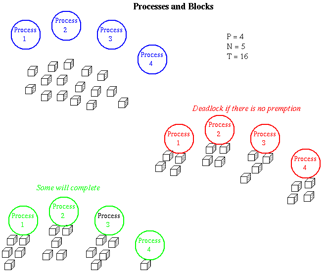
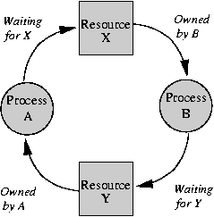

# Deadlock

* * *

**OSTEP**, Chapter 32



Deadlock is one area where there is a strong theory, but it is
almost completely ignored in practice. Reason: solutions
are expensive and/or require predicting the future.

A simple deadlock example with semaphores, for
two processes:

```

    Initialization
    --------------
    sem1 = new Semaphore(1);
    sem2 = new Semaphore(1);

    Process A        Process B
    ---------        ---------
     P(sem1)          P(sem2)
     P(sem2)          P(sem1)

```

Define deadlock: a situation wherein each of a collection of
processes is waiting for something from other processes in the
collection. Since all are waiting, none can provide any of the
things being waited for.

Deadlock can occur over separate resources, as in above
example, or even over separate copies of a single resource.
Block building contest:
suppose each of a collection of processes is trying to produce
a result by acquiring a number of resources one after the other.

- P processes.

- N blocks needed by each process.

- T total blocks.


Will the processes all be able to complete their jobs?



* * *

These are relatively simple-minded cases. Things may be much
more complicated:

- In general, do not know in advance how many resources
  a process will need. If only we could predict the future....

- There may be many different classes of resources, and
  one process may need resources from several classes.

- Processes may release and re-request the same resource.

- Deadlock can occur over anything involving waiting, for
  example messages in a pipe system. Hard for OS to control.


In general, there are four conditions for deadlock:

1. **No sharing of resources.**
   They can be used by only one process at a time.

2. **No preemption.**
   Once given, a resource cannot be taken away.

3. **Multiple independent requests.**
   Processes do not ask
   for resources all at once.

4. **Circularity in the Resource Graph.**
   The **Resource Graph** describes who has what and who wants what.
   Draw graph showing processes as circles,
   resources as squares, arrows from process to resource waited
   for, from resource to owning process.


   


   Now, as an exercise, try to draw the **Resource Graph** for the intersection diagram
   shown at the start of
   this lecture.
   The hardest part is to identify the shared resources.


   * * *


   The **Dining Philosophers Problem** (due to Edsger Dijkstra and Tony Hoare, 1965)


   


   - Five philosophers sit at a circular table doing one of two things:
      _eating_ or _thinking_.
   - While eating, they are not thinking, and while thinking, they are not eating.
   - A large bowl of spaghetti is in the center and a fork is placed in between each pair
      of adjacent philosophers.
   - This spaghetti is difficult to serve and eat with a single fork, so each philosopher
      **must acquire two forks to eat**.
   - Each philosopher **can only use the forks on their immediate left and right**.
   - Each philosopher can acquire forks only **one at a time**.
   - Philosophers never speak to each other.

* * *

Solutions to the deadlock problem fall into two general categories:

   - Detection: determine when the system is deadlocked and
     then take drastic action. Requires termination of one or more
     processes in order to release their resources. Usually
     this is not practical.

   - Prevention: organize the system so that it is impossible
     for deadlock ever to occur. May lead to less efficient resource
     utilization in order to guarantee no deadlocks.


Deadlock prevention: must find a way to eliminate one of
the four necessary conditions for deadlock:

   - Create enough resources so that there is always plenty for all.

   - Do not allow waiting: mention phone company solution. This
     punts the problem back to the user.

   - Do not allow exclusive access. This is probably not reasonable.

   - Allow preemption.

   - Make process ask for everything at once. Either get them all
     or wait for them all. Tricky to implement: must be able to wait
     on many things without locking anything. Painful for process:
     may be difficult to predict, so must make very wasteful use of
     resources. This requires the process to predict the future.

   - Make _ordered_ or _hierarchical_ requests. E.g. ask for
     all S's, then all T's, etc. All processes must follow the same
     ordering scheme. Of course, for this you have to know in advance
     what is needed.


* * *

Dijkstra's _Banker's Algorithm_
is an approach to trying to give
processes as much as is possible, while guaranteeing no deadlock.
For a complete explanation, see
Silberschatz and Galvin, p. 298 (8th edition).

   - A process specifies the maximum amount of a resource it will ever
      need.

   - The process can never ask for more than this amount.

   - The total of all resources given will never exceed the total number of
      available resources (can not give away what you do not have - note
      how this is different from government).

   - Never grant a allocation request if it will:
     - prevent the first process from finishing; and
     - given that the first process finishes and releases all of its resource,
        prevent the second process from finishing; and
     - given that the first through _k_ th-1 processes finish and
        releases all of their resources,
        prevent the _k_ th process from finishing.

In general, prevention of deadlock is expensive and/or inefficient.
Detection is also expensive and recovery is seldom possible
(what if process has things in a weird state?).

* * *

Copyright © 2013, 2018 Barton P. Miller

Non-University of Wisconsin students and teachers are welcome
to print these notes their personal use.
Further reproduction requires permission of the author.

