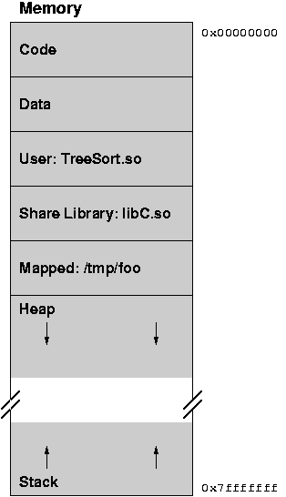
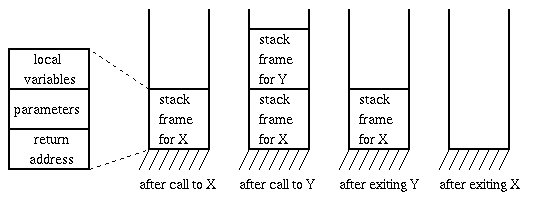
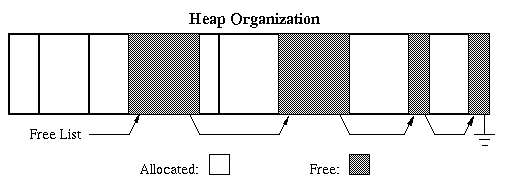
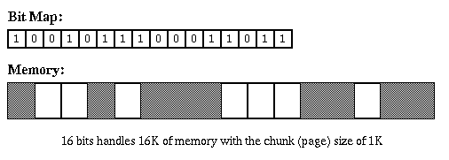
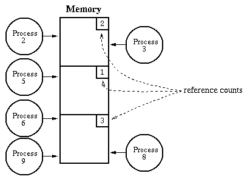
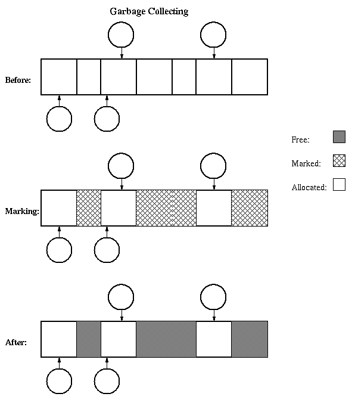

# 13: Storage Allocation

* * *

Chapter 8, Sections 8.1 through 8.3 in **Operating Systems Concepts**.

Information stored in memory is used in many different ways.
Some possible classifications are:

- Role in Programming Language:

  - Instructions (specify the operations to be performed
     and the operands to use in the operations).
  - Variables (the information that changes as the
     program runs: locals, owns, globals, parameters,
     dynamic storage).
  - Constants (information that is used as operands,
     but that never changes: pi for example).
- Changeability:

  - Read-only: _(code, constants)_.
  - Read & write: _(variables)_.

 Why is identifying non-changing memory useful or important?

- Initialized:
  - Code, constants, some variables: yes.
  - Most variables: no.
- Addresses vs. Data:
   Why is this distinction useful or important?

- Binding time:

  - Static: arrangement determined once and for all,
     before the program starts running. May happen
     at _compile-time_,
     _link-time_, or _load-time_.

  - Dynamic: arrangement cannot be determined until
     runtime, and may change.

 Note that the classifications overlap: variables may be static or
 dynamic, code may be read-only or read&write, etc.

The compiler, linker, operating system, and run-time library
all must cooperate to manage this information and perform
allocation.

When a process is running, what does its memory look like?
It is divided up into areas of stuff that the OS treats
similarly, called _segments_. In Unix/Linux, each process
has three segments:

- Code (called "text" in Unix terminology)
- Initialized data
- Uninitialized data
- User's dynamically linked libraries ( _shared objects_ (.so) or
   _dynamically linked libraries_ (.dll))
- Shared libraries (system dynamically linked libraries)
- Mapped files
- Stack(s)

In some systems, can have many different kinds of segments.

One of the steps in creating a process is to load its information
into main memory, creating the necessary segments. Information
comes from a file that gives the size and contents of each segment
(e.g. a.out in Unix/Linux and .exe in Windows).

The file is called an _object file_.

Division of responsibility between various portions of system:

- Compiler: generates one object file for each source code file
  containing information for that file. Information is incomplete,
  since each source file generally uses some things defined in
  other source files.

- Linker: combines all of the object files for one program into
  a single object file, which is complete and self-sufficient.

- Operating system: loads object files into memory, allows
  several different processes to share memory at once, provides
  facilities for processes to get more memory after they have
  started running.

- Run-time library: provides dynamic allocation routines, such
  as _calloc_ and _free_ in C.

* * *

### Dynamic Memory Allocation

Why is not static allocation sufficient for everything?
Unpredictability: cannot predict ahead of time how much
memory, or in what form, will be needed:

- Recursive procedures. Even regular procedures
   are hard to predict (data dependencies).
- OS does not know how many jobs there will be or which
   programs will be run.
- Complex data structures, e.g. linker symbol table.
   If all storage must be reserved in advance (statically), then it
   will be used inefficiently (enough will be reserved to handle
   the worst possible case).

Need dynamic memory allocation both for main memory and
for file space on disk.

Two basic operations in dynamic storage management:

- Allocate
- Free

Dynamic allocation can be handled in one of two general ways:

- Stack allocation (hierarchical): restricted, but
   simple and efficient.
- Heap allocation: more general, but less efficient, more
   difficult to implement.

Stack organization:
memory allocation and
freeing are partially predictable (as usual, we do better when
we can predict the future). Allocation is hierarchical: memory
is freed in opposite order from allocation. If alloc(A) then
alloc(B) then alloc(C), then it must be free(C) then free(B)
then free(A).

- Example: procedure call. Program calls Y, which calls X.
   Each call pushes another stack frame on top of the stack.
   Each stack frame has space for variable, parameters, and
   return addresses.
- Stacks are also useful for lots of other things: tree traversal,
   expression evaluation, top-down recursive descent parsers, etc.

A stack-based organization keeps all the free space together
in one place.

Heap organization: allocation and release are unpredictable.
Heaps are used for arbitrary list structures, complex data
organizations. Example: payroll system. Do not know when
employees will join and leave the company, must be able to
keep track of all them using the least possible amount of
storage.

- Inevitably end up with lots of holes. Goal: reuse the
   space in holes to keep the number of holes small, their
   size large.
- Fragmentation: inefficient use of memory due to holes
   that are too small to be useful. In stack allocation,
   all the holes are together in one big chunk.
- Refer to Knuth volume 1 for detailed treatment of what follows.
- Typically, heap allocation schemes use a _free list_ to
   keep track of the storage that is not in use. Algorithms
   differ in how they manage the free list.

  - Best fit: keep linked list of free blocks, search the
     whole list on each allocation, choose block that comes closest
     to matching the needs of the allocation, save the excess for
     later. During release operations, merge adjacent free blocks.
  - First fit: just scan list for the first hole that is
     large enough. Free excess. Also merge on releases. Most
     first fit implementations are rotating first fit.

- Bit Map: used for allocation of storage that comes in
   fixed-size chunks (e.g. disk blocks, or 32-byte chunks).
   Keep a large array of bits, one for each chunk. If bit is 0
   it means chunk is in use, if bit is 1 it means chunk is free.
   Will be discussed more when talking about file systems.

Pools: keep a separate allocation pool for each popular size.
Allocation is fast, no fragmentation.

Reclamation Methods: how do we know when memory can be freed?

- It is easy when a chunk is only used in one place.
- Reclamation is hard when information is shared: it cannot be recycled
   until all of the sharers are finished. Sharing is indicated by the
   presence of _pointers_ to the data (show example). Without a
   pointer, cannot access (cannot find it).

Two problems in reclamation:

- Dangling pointers: better not recycle storage while it is still
   being used.
- Core leaks:
   Better not "lose" storage by forgetting to free it even when
   it cannot ever be used again.

Reference Counts: keep track of the number of outstanding
pointers to each chunk of memory. When this goes to zero,
free the memory. Example:
Smalltalk, file descriptors in Unix/Linux. Works fine for hierarchical
structures. The reference counts must be managed automatically
(by the system) so no mistakes are made in incrementing and
decrementing them.

Garbage Collection: storage is not freed explicitly (using
free operation), but rather implicitly: just delete pointers.
When the system needs storage, it searches through all of the
pointers (must be able to find them all!) and collects things
that are not used. If structures are circular then this is
the only way to reclaim space. Makes life easier on the
application programmer, but garbage collectors are incredibly
difficult to program and debug, especially if compaction is
also done. Examples: Lisp, capability systems.

How does garbage collection work?

- Must be able to find all objects.
- Must be able to find all pointers to objects.
- Pass 1: mark. Go through all pointers that are known to
   be in use: local variables, global variables. Mark each
   object pointed to, and recursively mark all objects it
   points to.

- Pass 2: sweep. Go through all objects, free up those
   that are not marked.

Garbage collection is often expensive: 20% or more of all
CPU time in systems that use it.

* * *

Copyright © 1997, 2002, 2008 Barton P. Miller

Non-University of Wisconsin students and teachers are welcome
to print these notes their personal use.
Further reproduction requires permission of the author.

