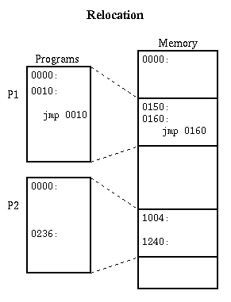
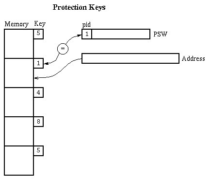
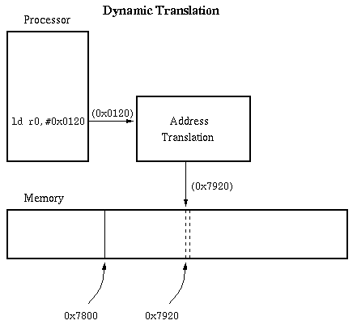

# Sharing Main Memory

[OSTEP Chapter 14](http://pages.cs.wisc.edu/~remzi/OSTEP/vm-mechanism.pdf)

Issues:

- Want to let several processes coexist in main memory.

- No process should need to be aware of the fact that
  memory is shared. Each must run regardless of the number
  and/or locations of processes.

- Processes must not be able to corrupt each other.

- Efficiency (both of CPU and memory) should not be
  degraded badly by sharing. After all, the purpose of
  sharing is to increase overall efficiency.

**Relocation: draw a simple picture of memory with some processes in it.**

- Because several processes share memory, we cannot
  predict in advance where a process will be loaded in
  memory. This is similar to a compiler's inability to
  predict where a subroutine will be after linking.

  

- Relocation adjusts a program to run in a different area
  of memory. Linker is an example of static relocation used
  to combine modules into programs. We now look at relocation
  techniques that allow several programs to share one main
  memory.

**Static software relocation, no protection:**

- Lowest memory holds OS.

- Processes are allocated memory above the OS.

- When a process is loaded, relocate it so that it can run
  in its allocated memory area (just like linker: linker
  combines several modules into one program, OS loader
  combines several processes to fit into one memory; only
  difference is that there are no cross-references between
  processes).

- Problem: any process can destroy any other process
  and/or the operating system.

- Examples: early batch monitors where only one job
  ran at a time and all it could do was wreck the OS,
  which would be rebooted by an operator. Many of
  today's personal computers also operate in a similar
  fashion.

* * *

**Static relocation with protection keys (IBM S/360 approach):**

- Protection Key = a small integer stored with each chunk
  of memory. The chunks are likely to be 1k-4k bytes.

- Keep an extra hardware register to identify the current process.
  This is called the process id, or PID. 0 is reserved for
  the operating system's process id.

- On every memory reference, check the PID of the current
  process against the key of the memory chunk being accessed.
  PID 0 is allowed to touch anything, but any other mismatch
  results in an error trap.

- Additional control: who is allowed to set the PID?

  How does OS regain control once it
  has given it up?

- This is the scheme used for the IBM S/360 family. It
  is safe but inconvenient:
  - Programs have to be relocated before loading. In some
    systems (e.g. MPS) this requires complete relinking. Expensive.

  - Cannot share information between two processes
    very easily

  - Cannot swap a process out to secondary storage and
    bring it back to a different location

* * *

**Dynamic memory relocation:**

**This section is very important to understand how real memory systems work!**

Instead of changing the addresses
of a program before it is loaded, we change the address dynamically
_during every reference_.

- Under dynamic relocation, each program-generated address
  called a
  _virtual address_)
  also called a _logical address_),
  is translated in hardware to a
  _physical address_
  (also called a
  _real address_).
  This happens as part of each memory reference.

  

- Show how dynamic relocation leads to two views of memory,
  called _address spaces_. With static relocation we
  force the views to coincide. That there can be
  several levels of mapping.

* * *

Copyright © 2015, 2018 Barton P. Miller

Non-University of Wisconsin students and teachers are welcome
to print these notes their personal use.
Further reproduction requires permission of the author.

