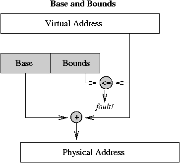
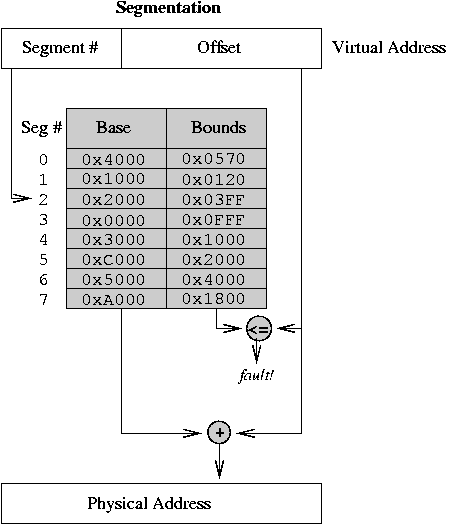

# Base and Bounds, Segmentation

* * *

**OSTEP** Chapter 15

## Base & Bounds Address Translation



- Two hardware registers: base address for process, bounds
  register that indicates the last valid address the process
  may generate.
  Each process must be allocated contiguously in real memory.
  This contiguous memory is called a
  _segment_.

- On each memory reference, the virtual address is compared
  to the bounds register, then added to the base register.
  A bounds violation results in an error interrupt.

- Each process appears to have a completely private memory of
  size equal to the bounds register plus 1.
  Processes are protected from each other.
  No address relocation is necessary when a process is loaded.

- Typically, the OS runs with relocation turned off, and there
  are special instructions to branch to and from the OS while
  at the same time turning relocation on and off. Modification
  of the base and bounds registers must also be controlled.

- Base & bounds is cheap -- only 2 registers -- and
  fast -- the add and compare can be done in parallel.

- Can support swapping of processes in and out of memory.

- Classic example: The CRAY-1.


Problems with base & bounds relocation:

- Only one segment. How can two processes share code while
  keeping private data areas (e.g. shared editor)?
  Draw a picture to show that it cannot be done safely with
  a single-segment scheme.


## Segmentation

Let's generalize this base and bounds approach to allow multiple segments
per process.

- Permit process to be split between several areas of
  memory. Each area is called a _segment_ and contains
  a collection of logically-related information, e.g. code
  or data for a module.


  

- Use a separate base and bound for each segment, and
  also add a protection bit (read/write).

- Each memory reference indicates a segment and offset in one
  or more of three ways:
  1. Top bits of address select segment, low bits the offset.
     This is the most common, and the best.

  2. Or, segment is selected implicitly by the operation
     being performed (e.g. code vs. data, stack vs. data).

  3. Or, segment is selected by fields in the instruction
     (as in Intel x86 prefixes).


     (The last two alternatives are kludges used for machines with
     such small addresses that there is not room for both a segment
     number and an offset)

Segment table holds the bases and bounds for all the segments
of a process.

Show memory mapping procedure, involving table lookup + add +
compare. Example: PDP-10 with high and low segments
selected by high-order address bit.

Segmentation example: 8-bit segment number, 16-bit offset.

- Segment table (use above picture -- all numbers in hexadecimal):

- Code in segment 0 (addresses are virtual):


  ```
  	0x00242:	mov  0x60100,%r1
  	0x00246:	st   %r1,0x30107
  	0x0024A:	b    0x20360

  ```

- Code in segment 2:


  ```
  	0x20360:	ld   [%r1+2],%r2
  	0x20364:	ld   [%r2],%r3
  			...
  	0x203C0:	ret

  ```


Advantage of segmentation: segments can be swapped and assigned to storage
independently.

Problems:

- External fragmentation: segments of many
  different sizes.

- Segments may be large, have to be allocated
  contiguously.

- (These problems also apply to base and bound schemes)


Example: in PDP-10's when a segment gets larger, it may have
to be shuffled to make room. If things get really bad it may
be necessary to compact memory.

* * *

Copyright © 2013, 2018, 2020 Barton P. Miller

Non-University of Wisconsin students and teachers are welcome
to print these notes their personal use.
Further reproduction requires permission of the author.

