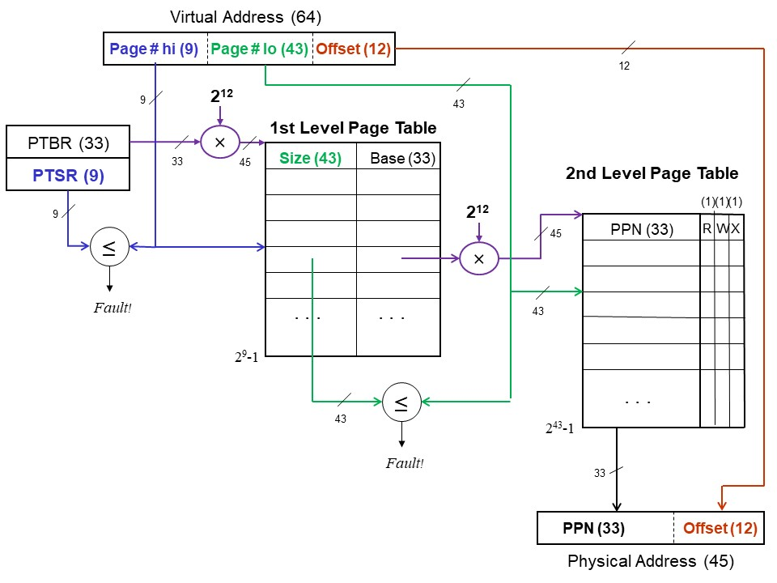
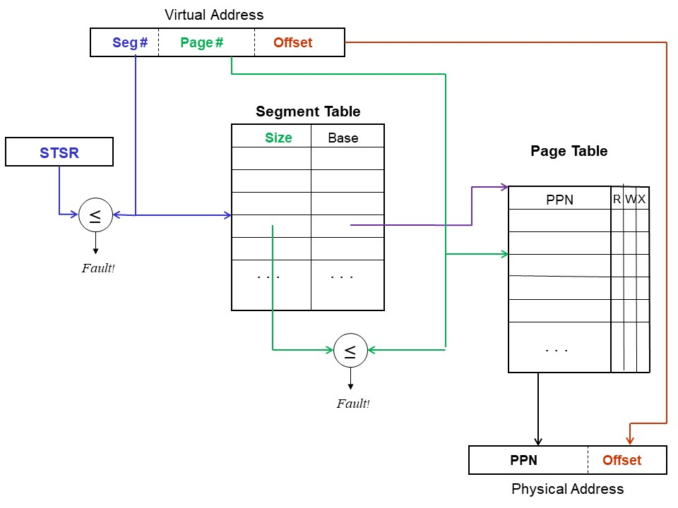

# Paging

* * *

**OSTEP** Chapters 18 and 20

### Paging

Goal is to make allocation and swapping easier, and
to reduce memory fragmentation.

- Make all chunks of memory the same size, call them
  _pages_.
  Typical sizes range from 512-8k bytes.

- For each process, a
  _page table_
  defines the base
  address of each of that process' pages along with
  read/only and existence bits.

- Page number always comes directly from the address. Since
  page size is a power of two, no comparison or addition is necessary.
  Just do table lookup and bit substitution.

- Easy to allocate: keep a free list of available pages
  and grab the first one. Easy to swap since everything
  is the same size, which is usually the same size as disk
  blocks to and from which pages are swapped.

**Now, let's put size information on the table:**

- 32 bit virtual addresses,

- 16 kilobyte (KB) page size,

- 1 gigabyte (GB) of real memory,

- page tables are stored in real memory (RAM),

- page tables can start on any **byte** boundary,

- each page has permission bits for read, write and execute.

Problems:

- Internal fragmentation: page size does not match up
   with information size. The larger the page, the worse
   this is.

- Table space: if pages are small, the table space
   could be substantial. In fact, this is a problem even
   for normal page sizes: consider a 32-bit address
   space with 1k pages. What if the whole table has to
   be present at once? Partial solution: keep base and bounds for
   page table, so only large processes have to have large
   tables.

- Efficiency of access: it may take one overhead reference
   for every real memory reference (page table is so big it
   has to be kept in memory).

* * *

### Two-Level (Multi-Level) Paging

Use two levels of mapping to make tables manageable.

**Now, let's put size information on the table:**

- 64 bit virtual addresses,

- 4 kilobyte (KB) page size,

- 32 terabytes (TB) of real memory,

- first and second level page tables are stored in real memory (RAM),

- all page tables can start only on a **page** boundary,

- the first level page table can have a maximum of 512 entries,

- each page has permission bits for read, write and execute.

* * *

### Segmentation and Paging

Use two levels of mapping, with logical sizes for objects, to make tables manageable.

- Each segment contains one or more pages.

- Segment correspond to logical units: code, data, stack.
  Segments vary in size and are often large.
  Pages are for the use of the OS; they are fixed size to
  make it easy to manage memory.

- Going from paging to P+S is like going from single segment to
  multiple segments, except at a higher level. Instead of having
  a single page table, have many page tables with a base and
  bound for each. Call the stuff associated with each page table
  a segment.

- If a segment is not used, then there is no need to even
  have a page table for it.

- Can share at two levels: single page, or single segment
  (whole page table).

Pages eliminate external fragmentation, and make it
possible for segments to grow without any reshuffling.

If page size is small compared to most segments, then
internal fragmentation is not too bad.

The user is not given access to the paging tables.

If translation tables are kept in main memory, overheads could be
very high: 1 or 2 overhead references for every real reference.

IBM System 370 example: 24-bit virtual address space,
4 bits of segment number, 8 bits of page number, and
12 bits of offset. Segment table are in
**registers** and not in memory.
Segment table entries contain the real address
of page table along with the length of the page table
(a sort of bounds register for the segment).
Page table entries are only 12 bits, real addresses are 24 bits.

Another example you can try: the DEC VAX.

- Address is 32 bits, top two select segment. Three base-bound
  pairs define page tables (system, P0, P1).
  These bound-bound pairs are in registers.

- Pages are 512 bytes long.

- Read-write protection information is contained in the
  page table entries, not in the segment table.

- One segment contains operating system stuff, two contain
  stuff of current user process.

- Potential problem: page tables can get big. Do not want to
  have to allocate them contiguously, especially for large
  user processes. Solution:
  - System base-bounds pairs are physical addresses, system
    tables must be contiguous.

  - User base-bounds pairs are virtual addresses in the system
    space. This allows the user page tables to be scattered in
    non-contiguous pages of physical memory.

  - The result is a two-level scheme.

In current systems, you will see three and even four-level schemes to
handle 64-bit address spaces.

* * *

Copyright © 2011, 2018, 2020 Barton P. Miller

Non-University of Wisconsin students and teachers are welcome
to print these notes their personal use.
Further reproduction requires permission of the author.

