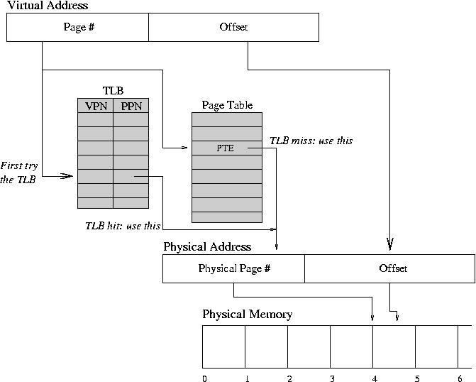
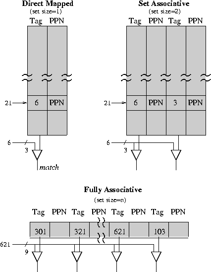

# Translation Buffers and Inverted Page Tables

* * *

**OSTEP** Chapter 19

Remember that the

Problem with virtual address translatation:
extra memory references are needed
to access translation tables, and these
memory references can slow programs down by a factor
of two or three.
There are too many entries in typical page tables to
keep them all loaded registers so they need to reside im
memory (RAM).

We will introduce the fundamental concept of _locality_:
at any given time a process is only using a few pages or segments.

* * *



### Translation Lookaside Buffer

Solution: Translation Lookaside Buffer (TLB).
A translation buffer is used to store a few of the
translation table entries. It is very fast, but only
remembers a small number of entries. On each memory
reference:

- First ask TLB if it knows about the page. If so, the
  reference proceeds fast.

- If TLB has no info for page, must go through page and
  segment tables to get info. Reference takes a long time,
  but give the info for this page to TLB so it will know
  it for next reference (TLB must forget one of its current
  entries in order to record new one).


TLB Organization:
Show picture of black box. Virtual page number goes in,
physical page location comes out. Similar to a cache,
usually direct mapped.

TLB is just a memory with some comparators. Typical size
of memory: 128 entries. Each entry holds a virtual page
number and the corresponding physical page number. How
can memory be organized to find an entry quickly?

- One possibility: search whole table from start on
  every reference.

- A better possibility: restrict the info for any given
  virtual page to fall in exactly one location in
  the memory. Then only need
  to check that one location. E.g. use the low-order bits of
  the virtual page number as the index into the memory. This
  is the way real TLB's work.


Disadvantage of TLB scheme: if two pages use the same
entry of the memory, only one of them can be remembered
at once. If process is referencing both pages at same time,
TLB does not work very well.

Example: TLB with 64 (100 octal) slots. Suppose
the following virtual pages are referenced (octal): 621,
2145, 621, 2145, ... 321, 2145, 321, 621.

TLBs are a lot like hash tables except
simpler (must be to be implemented in hardware). Some
hash functions are better than others.

- Is it better to use low page number bits than high ones?

- Is there any way to improve on the TLB hashing function?




Another approach: let any given virtual page use either
of _two_ slots in the TLB. Make memory wider, use two
comparators to check both slots at once.

- This is as fast as the simple scheme, but a bit more
  expensive (two comparators instead of one, also have
  to decide which old entry to replace when bringing in
  a new entry).

- Advantage: less likely that there will be conflicts that
  degrade performance (takes three pages falling in the same
  place, instead of two).

- Explain names:
  - Direct mapped.

  - Set associative.

  - Fully associative.

Must be careful to flush TLB during each context swap. Why?

In practice, TLB's have been extremely successful with 95% or great
hit rates for relatively small sizes.

* * *

### Inverted Page Tables

As address spaces have grown to 64 bits, the side of traditional page
tables becomes a problem.
Even with two-level (or even three or four!) page tables, the tables
themselves can become too large.

A solution (used on the IBM Power, Sun SPARC, and others) to this
problem has two parts:

- A _physical_ page table instead of a
  _logical_ one.
  The physical page table is often called an _inverted_ page table.
  This table contains one entry per page frame.
  An inverted page table is very good at mapping from physical page to logical
  page number (as is done by the operating system during a page fault), but not
  very good at mapping from virtual page number to physical page number (as is
  done on every memory reference by the processor).

- A TLB fixes the above problem.
  Since there is no other hardware or registers dedicated to memory mapping,
  the TLB can be quite larger so that missing-entry faults are rare.


With an inverted page table, most address translations are handled by the
TLB.
When there is a miss in the TLB, the operating is notified (via an interrupt)
and TLB miss-handler is invoked.

* * *

### Shadow Tables

The operating system can sometimes be thought of as an extension of
the abstractions provided by the hardware.
However, when the table format is defined by the hardware (such as
for a page table entry), you cannot change that format.
So, what do you do if you you wanted to store additional information,
such as last reference time or sharing pointer,
in each entry?

The general is a technique that is sometimes called a
_shadow table_.
The idea of a shadow is simple (and familiar to Fortran programmers!):

- Consider the hardware defined data structure as an array.
- For the new information that you want to add, define a new (shadow) array.
- There is one entry in the shadow array for each entry in the hardware array.
- For each new item you want to add to the data structure, you add a new data
   member to the shadow array.

For example, consider the hardware defined page table to be an array of structures:

```

    struct Page_Entry {
	unsigned PageFrame_hi   : 10;  // 42-bit page frame number
	unsigned PageFrame_mid  : 16;
	unsigned PageFrame_low  : 16;
	unsigned UserRead       :  1;
	unsigned UserWrite      :  1;
	unsigned KernelRead     :  1;
	unsigned KernelWrite    :  1;
	unsigned Reference      :  1;
	unsigned Dirty          :  1;
	unsigned Valid          :  1;
    }

    struct Page_Entry pageTable[TABLESIZE];

```

If you wanted to added a couple of data members, you **cannot** simply
change it to the following:

```

    struct Page_Entry {
	unsigned PageFrame_hi   : 10;
	unsigned PageFrame_mid  : 16;
	unsigned PageFrame_low  : 16;
	unsigned UserRead       :  1;
	unsigned UserWrite      :  1;
	unsigned KernelRead     :  1;
	unsigned KernelWrite    :  1;
	unsigned Reference      :  1;
	unsigned Dirty          :  1;
	unsigned Valid          :  1;
	Time_t lastRefTime;
	PageList *shared;
    }

```

Instead, you would define a a second array based on this type:

```

    struct Page_Entry {                      struct PE_Shadow {
	unsigned PageFrame_hi   : 10;            Time_t lastRefTime;
	unsigned PageFrame_mid  : 16;            PageList *shared;
	unsigned PageFrame_low  : 16;        }
	unsigned UserRead       :  1;
	unsigned UserWrite      :  1;
	unsigned KernelRead     :  1;
	unsigned KernelWrite    :  1;
	unsigned Reference      :  1;
	unsigned Dirty          :  1;
	unsigned Valid          :  1;
    }

    struct Page_Entry pageTable[TABLESIZE];
    struct PE_Shadow  pageShadow[TABLESIZE];

```

* * *

Copyright © 2016, 2018 Barton P. Miller

Non-University of Wisconsin students and teachers are welcome
to print these notes their personal use.
Further reproduction requires permission of the author.

