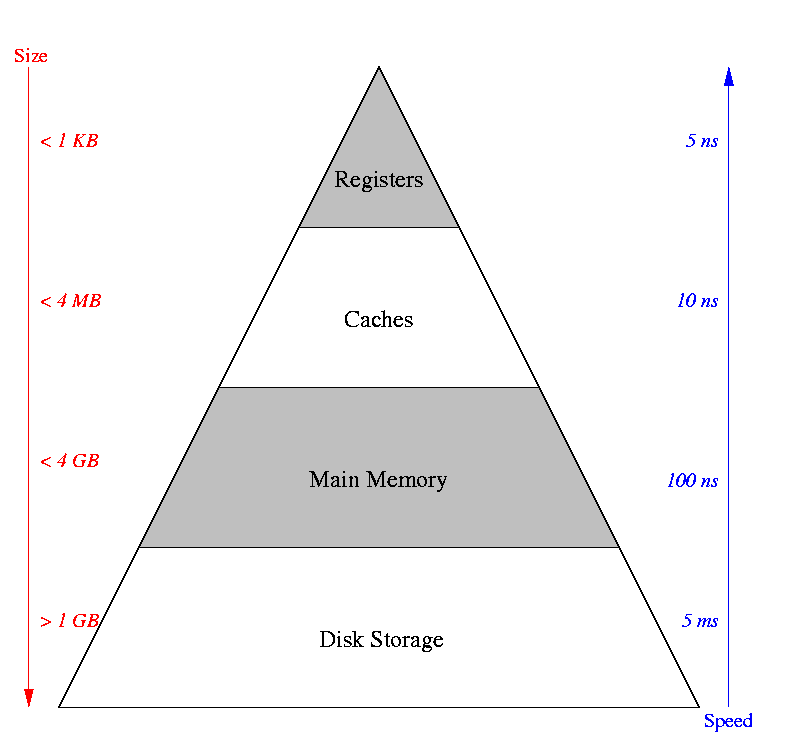
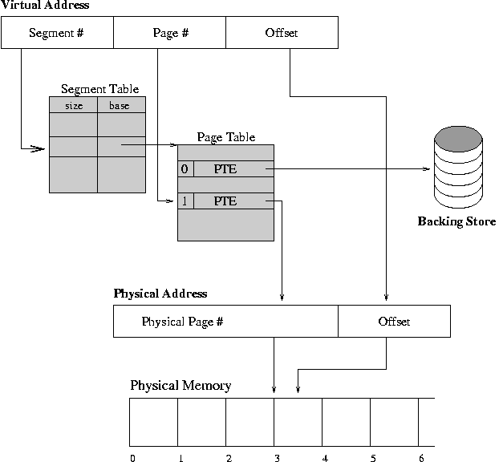

# Virtual Memory, Page Faults

* * *

**OSTEP** Chapter 21

Problem: how does the operating system get information from user
memory? E.g. I/O buffers, parameter blocks. Note that the user
passes the OS a _virtual address_.

- In some cases the OS just runs unmapped. Then all it has
  to do is read the tables and translate user addresses in
  software. However, addresses that are contiguous in the
  virtual address space may not be contiguous physically. Thus
  I/O operations may have to be split up into multiple blocks.
  Draw an example.

- Suppose the operating system also runs mapped. Then it must
  generate a page table entry for the user area. Some machines
  provide special instructions to get at user stuff. Note that
  under no circumstances should users be given access to mapping
  tables.

- A few machines, most notably the VAX, make both system information
  and user information visible at once (but cannot touch system
  stuff unless running with special kernel protection bit set).
  This makes life easy for the kernel, although it does not
  solve the I/O problem.

So far we have disentangled the programmer's view of memory from the
system's view using a mapping mechanism. Each sees a different
organization. This makes it easier for the OS to
shuffle users around and simplifies memory sharing between
users.

However, until now a user process had to be completely
loaded into memory before it could run.
This is wasteful since a process only needs a small amount of its
total memory at any one time (locality). Virtual memory permits
a process to run with only some of its virtual address space
loaded into physical memory.

* * *

### The Memory Hierarchy (thanks to Andrea Arpaci-Dusseau)

The idea is to produce the illusion of a memory with the size of the
disk and the speed of main memory.

Data can be in registers (very fast), caches (fast), main memory (not so
fast, or disk (slow).
Keep the things that you use frequently as close to you (and as fast to access)
as possible.

The reason that this works is that most programs spend most of
their time in only a small piece of the code. Give Knuth's
estimate of 90% of the time in 10% of the code. Introduce
again the principle of _locality_.

* * *

### Page Faults

If not all of a process is loaded when it is running, what happens
when it references a byte that is only in the backing store?
Hardware and software cooperate to make things work anyway.

- First, extend the page tables with an extra bit "present". If
   present is not set then a reference to the page results in a trap.
   This trap is given a special name, _page fault_.

- Any page not in main memory right now has the "present" bit
   cleared in its page table entry.

- When page fault occurs:
  - Operating system brings page into memory.
  - Page table is updated, "present" bit is set.
  - The process is continued.

Continuing process is very tricky, since it may
have been aborted in the middle of an instruction. Do not
want user process to be aware that the page fault even happened.

- Can the instruction just be skipped?

- Suppose the instruction is restarted from the beginning. How
  is the "beginning" located?

- Even if the beginning is found, what about instructions with
  side effects, like:
  `ld [%r2], %r2`
- Without additional information from the
  hardware, it may be impossible to restart a process after a
  page fault. Machines that permit restarting must have
  hardware support to keep track of all the side effects so
  that they can be undone before restarting.

- Forest Baskett's approach for the old Zilog Z8000
  _(two processors, one just for handling page faults)_
- IBM 370 solution
  _(execute long instructions twice)_.

- If you think about this when designing the instruction
  set, it is not too hard to make a machine virtualizable. It is
  much harder to do after the fact. VAX is example of doing it
  right.

* * *

### Effective Access Time Calculation

We can calculate the estimated cost of page faults by performing an
_effective access time_ calcuation.
The basic idea is that sometimes you access a location quickly
(there is no page fault) and sometimes more slowly (you have to
wait for a page to come into memory).
We use the cost of each type of access and the pecentage of time
that it occurs to computer the average time to access a word of
memory.

Let:

- _h_ = fraction of time that a reference does **not** require
   a page fault.

- _tmem_ = time it takes to read a word from memory.

- _tdisk_ = time it takes to read a page from disk.

then

- _EAT = h \* tmem \+ (1 - h) \* tdisk_.

If there a multiple classes of memory accesses, such as no disk access,
one disk access, and two disk access, then you would have a fraction
( _h_) and access time ( _t_) for each class of access.

Note that this calculation is the same type that computer architects
use to calculate memory performance.
In that case, their access classes might be (1) cached in L1, (2) cached
in L2, and (3) RAM.

* * *

Copyright © 2013, 2018 Barton P. Miller

Non-University of Wisconsin students and teachers are welcome
to print these notes their personal use.
Further reproduction requires permission of the author.

