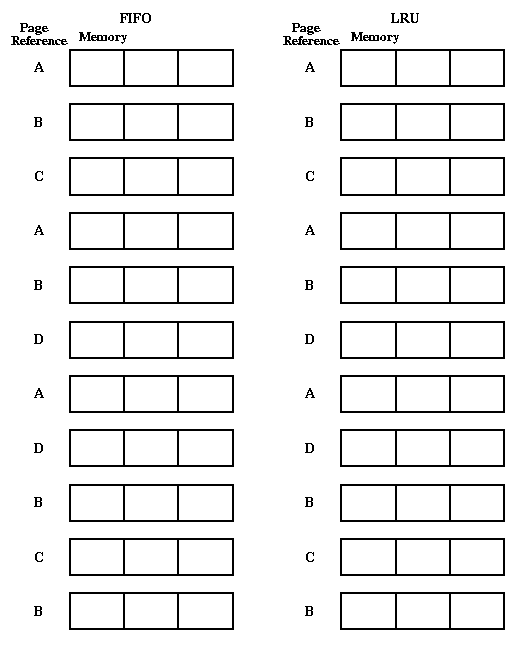

**OSTEP** Chapter 22

Once the hardware has provided basic capabilities for
virtual memory, the OS must make
two kinds of scheduling decisions:

- Page selection: when to bring pages into memory.

- Page replacement: which page(s) should be thrown out, and when.

Page selection Algorithms:

- Demand paging: start up process with no pages loaded,
  load a page when a page fault for it occurs, i.e. until it
  absolutely MUST be in memory. Almost all paging systems
  are like this.

- Request paging: let user say which pages are needed.
  The trouble is, users do not always know best, and are not
  always impartial. They will overestimate needs.

- Prepaging: bring a page into memory before it is
  referenced (e.g. when one page is referenced, bring in the
  next one, just in case). Hard to do effectively without a
  prophet, may spend a lot of time doing wasted work.

Page Replacement Algorithms:

- Random: pick any page at random (works surprisingly well!).

- FIFO: throw out the page that has been in memory the longest.
  The idea is to be fair, give all pages equal residency.

- MIN: naturally, the best algorithm arises if we can predict
  the future.

- LFU: use the frequency of past references to predict the future.

- LRU: use the order of past references to predict the future.

Example: Try the reference string A B C A B D A D B C B,
assume there are three page frames of physical memory. Show
the memory allocation state after each memory reference.

Note that MIN is optimal (cannot be beaten), but that the principle
of locality states that past behavior predicts future behavior, thus
LRU should do just about as well.

Implementing LRU: need some form of hardware support, in order
to keep track of which pages have been used recently.

- Perfect LRU? Keep a register for each page, and store the
  system clock into that register on each memory reference.
  To replace a page, scan through all of them to find the
  one with the oldest clock. This is expensive if there are
  a lot of memory pages.

- In practice, nobody implements perfect LRU. Instead, we
  settle for an approximation which is efficient. Just find
  an old page, not necessarily the oldest. LRU is just an
  approximation anyway (why not approximate a little more?).

* * *

Copyright © 2013, 2018 Barton P. Miller

Non-University of Wisconsin students and teachers are welcome
to print these notes their personal use.
Further reproduction requires permission of the author.

