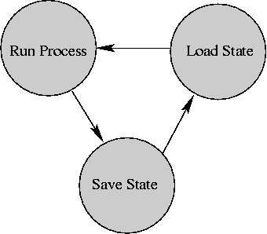

# Introduction to Processes

* * *

OSTEP: Chapter 4.

With so many things happening at once in system, need some
way of separating them all out cleanly. That is a process.

Important concept: decomposition. Given hard problem, chop
it up into several simpler problems that can be solved
separately.

What is a process?

- "An execution stream in the context of a particular process state."

- A more intuitive, but less precise, definition is just a running
  piece of code along with all the things that the code can affect or be
  affected by.

- Process state is everything that can affect, or be affected by, the
  process: includes code, particular data values, open files, etc.

- Execution stream is a sequence of instructions performed in a
  process state.

- Only one thing happens at a time within a process.

Is a process the same as a program?

Some systems allow only one process (mostly personal
computers). They
are called _uniprogramming_ systems (not uniprocessing;
that means only one processor). Easier to write some parts
of OS, but many other things are hard to do.

* * *

Most systems allow more than one process. They are called
_multiprogramming_ systems.

First, have to keep track of all the processes.
For each process, _process control block_ holds:

- Execution state (saved registers, etc.)

- Scheduling information

- Accounting and other miscellaneous information.

Process table: collection of all process control blocks for
all processes.

**Process Control Block**Execution

State
Scheduling

Information
Accounting

and

Miscellaneous

How can several processes share one CPU? OS must make sure
that processes do not interfere with each other. This means

- Making sure each gets a chance to run (fair scheduling).

- Making sure they do not modify each other's state (protection).

_Dispatcher_ (also called Short Term Scheduler): inner-most portion of the
OS that runs processes:

- Run process for a while

- Save state

- Load state of another process

- Run it ...

* * *

Copyright © 2018 Barton P. Miller

Non-University of Wisconsin students and teachers are welcome
to print these notes their personal use.
Further reproduction requires permission of the author.

