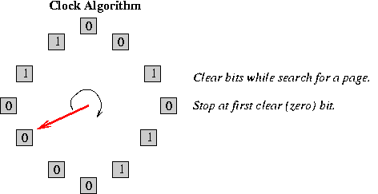
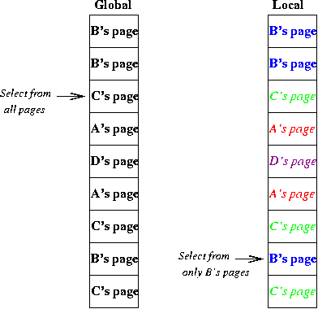
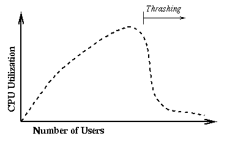

# Clock Algorithm, Thrashing

* * *

**OSTEP** Chapter 22

This is an efficient way to approximate LRU.

Clock algorithm: keep "use" bit for each page frame,
hardware sets the appropriate bit on every memory reference.
The operating system clears the bits from time to time in
order to figure out how often pages are being referenced.
Introduce clock algorithm where to find a page to throw out
the OS circulates through the physical frames clearing use
bits until one is found that is zero. Use that one. Show
clock analogy.

Fancier algorithm: give pages a second (third? fourth?)
chance. Store (in software) a counter for each page frame,
and increment the counter if use bit is zero. Only throw
the page out if the counter passes a certain limit value.
Limit = 0 corresponds to the previous case. What happens
when limit is small? large?

Some systems also use a "dirty" bit to give preference
to dirty pages. This is because it is more expensive to
throw out dirty pages: clean ones need not be written to
disk.

What does it mean if the clock hand is sweeping very
slowly?

What does it mean if the clock hand is sweeping very
fast?

If all pages from all processes are lumped together by the
replacement algorithm, then it is said to be a _global_
_replacement algorithm_.
Under this scheme, each process
competes with all of the other processes for page frames. A
_per process replacement algorithm_ allocates page frames
to individual processes: a page fault in one process can only
replace one of that process' frames. This relieves interference
from other processes.
A _per job replacement algorithm_ has
a similar effect (e.g. if you run vi it may cause your shell to
lose pages, but will not affect other users). In per-process and
per-job allocation, the allocations may change, but only slowly.

Thrashing: consider what happens when memory gets overcommitted.

- Suppose there are many users, and that between them their
  processes are making frequent references to 50 pages, but
  memory has 40 pages.

- Each time one page is brought in, another page, whose contents
  will soon be referenced, is thrown out.

- Compute average memory access time.

- The system will spend all of its time reading and writing pages.
  It will be working very hard but not getting anything done.

- Thrashing was a severe problem in early demand paging systems.

Thrashing occurs because the system does not know when it has taken
on more work than it can handle. LRU mechanisms order pages in
terms of last access, but do not give absolute numbers indicating
pages that _must not_ be thrown out.

What can be done?

- If a single process is too large for memory, there is nothing
  the OS can do. That process will simply thrash.

- If the problem arises because of the sum of several processes:
  - Figure out how much memory each process needs.

  - Change scheduling priorities to run processes in
    groups whose memory needs can be satisfied.

* * *

Copyright © 2013, 2018 Barton P. Miller

Non-University of Wisconsin students and teachers are welcome
to print these notes their personal use.
Further reproduction requires permission of the author.

