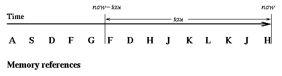

# Working Sets

* * *

Chapter 9, Sections 9.6 and 9.7 in **Operating Systems Concepts**.

_Working Sets_ are a solution proposed by Peter Denning.

> Peter J. Denning,
>  The Working Set Model of Program Behavior,
>  _Communications of the ACM_,
>  **11**
>  5,
>  May 1968,
>  pp. 323-333.

An informal definition is "the collection of pages that a process is
working with, and which must thus be resident if the process is to
avoid thrashing."
The idea is to use the recent needs of a process to predict its future needs.

- Choose τ (tau), the working set parameter. At any given time,
  all pages referenced by a process in its last τ seconds
  of execution are considered to comprise its _working set_.

  

  Note that τ should be measured in CPU time (also called
  _process time_ or
  _virtual time_).

  Why is this?

- A process will never be executed unless its working set
  is resident in main memory. Pages outside the working set
  may be discarded at any time.

Working sets are not enough by themselves to make sure memory does not get
overcommitted. We must also introduce the idea of a _balance set_:

- If the sum of the working sets of all runnable processes is
  greater than the size of memory, then refuse to run
  some of the processes (for a while).

- Divide runnable processes up into two groups: active and
  inactive. When a process is made active its working set is
  loaded, when it is made inactive its working set is allowed
  to migrate back to disk. The collection of active processes
  is called the _balance set_.

- Some algorithm must be provided for moving processes into and
  out of the balance set. What happens if the balance set
  changes too frequently?

As working sets change, corresponding changes will have to be
made in the balance set.

Problem with the working set: must constantly be updating working set
information.

- One of the initial plans was to store some sort of a capacitor
  with each memory page. The capacitor would be charged on each
  reference, then would discharge slowly if the page was not
  referenced. Tau would be determined by the size of the
  capacitor. This was not actually implemented. One problem
  is that we want separate working sets for each process, so
  the capacitor should only be allowed to discharge when a
  particular process executes. What if a page is shared?

- Actual solution: take advantage of use bits
  - OS maintains _idle time_ value for each page: amount
     of CPU time received by process since last access to page.

  - Every once in a while, scan all pages of a process. For
     each use bit on, clear page's idle time. For use bit off,
     add process' CPU time (since last scan) to idle time.
     Turn all use bits off during scan.

  - Scans happen on order of every few seconds.

This actual solution is an approximation algorithm known as
_WSClock_.

Other questions about working sets and memory management in general:

- What should τ be?
  - What if it is too large?

  - What if it is too small?
- What algorithms should be used to determine which processes
  are in the balance set?

- How do we compute working sets if pages are shared?

- How much memory is needed in order to keep the CPU busy?
  Note than under working set methods the CPU may occasionally
  sit idle even though there are runnable processes.

THIS ENDS THE SECTION ON MEMORY MANAGEMENT

* * *

Copyright © 2008, 2013 Barton P. Miller

Non-University of Wisconsin students and teachers are welcome
to print these notes their personal use.
Further reproduction requires permission of the author.

