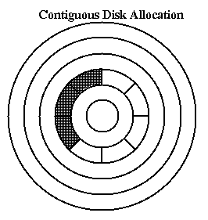
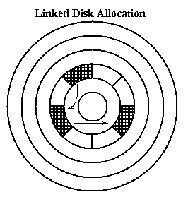
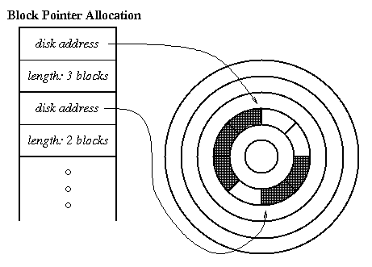
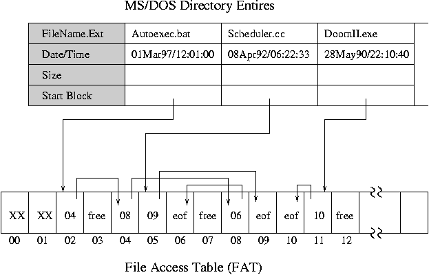

# Files, Disk Management

* * *

OSTEP: Chapters 36, 37

File: a named collection of bits stored on disk. From
the OS' standpoint, the file consists of a bunch of blocks
stored on the device. Programmer may actually see a different
interface (bytes or records), but this does not matter to the
file system (just pack bytes into blocks, unpack them again
on reading).

Common addressing patterns:

- Sequential: information is processed in order, one piece
  after the other. This is by far the most common mode:
  e.g. editor writes out new file, compiler compiles it,
  etc.

- Random Access: can address any record in the file directly
  without passing through its predecessors. E.g. the data set
  for demand paging, also databases.

- Keyed: search for records with particular values, e.g.
  hash table, associative database, dictionary. Usually not provided by
  operating system.
  _TLB is one example of a keyed search._

Modern file systems must address four general problems:

- Disk Management: efficient use of disk space, fast access
  to files, sharing of space between several users.

- Naming: how do users select files?

- Protection: all users are not equal.

- Reliability: information must last safely for long periods
  of time.

Disk Management: how should the disk sectors be used to
represent the blocks
of a file? The structure used to describe which sectors
represent a file is called the _file descriptor_.

### Contiguous allocation:

allocate files like segmented memory
(give each disk sector a number from 0 up). Keep
a free list of unused areas of the disk. When creating a file,
make the user specify its length, allocate all the space at once.
Descriptor contains location and size.

- Advantages: easy access, both sequential and random.
  Simple. Few seeks.

- Drawbacks: horrible fragmentation will preclude large files,
  hard to predict needs. With interleaved user requests, still
  cannot eliminate all seeks.

### Linked Files:

In the file descriptor, just keep pointer to first block.
In each block of file keep pointer to next block.
Can also keep a linked list of free blocks for the free list.

- Advantages: Files can be extended, no fragmentation problems.
  Sequential Access is easy: just chase links.
  No extra space for the free list.

- Drawbacks: Random access is virtually impossible.
  Lots of seeking, even in sequential access.
  Pointer to next block occupies same block as data.

- Example: FAT (MSDOS) file system.

### Array of Block Pointers (Extents):

Allocate an array to hold pointers to all the blocks, but do not allocate the blocks.
Then fill in the pointers dynamically using a free list.

- Advantages: Both sequential and random access are easy.

- Drawbacks: still have to set maximum file size, and there
  will be lots of seeks.

### DOS FAT File File System:

A single File Allocation Table (FAT)
that combines free list info and file allocation info.
In file descriptor, keep pointer to first block.
A FAT table entry contains either (1) the block number of the next
block in the file, (2) a distinguished "end of file" (eof) value, or
(3) a distinguished "free" value.

- Advantages/Disadvantages: similar to those mentioned above for linked
  file.

  None of these is a very good solution: what is the answer? First,
  and MOST IMPORTANT: understand the application. How are file
  systems used?

  - Most files are small.

  - Much of the disk is allocated to large files.

  - Many of the I/O's are made to large files.

Thus, the per-file cost must be low, but the performance of large files
must be good. Must allow reasonably fast random access, extensibility.

* * *

Copyright © 2013, 2018 Barton P. Miller

Non-University of Wisconsin students and teachers are welcome
to print these notes their personal use.
Further reproduction requires permission of the author.

