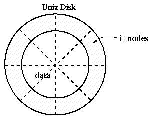
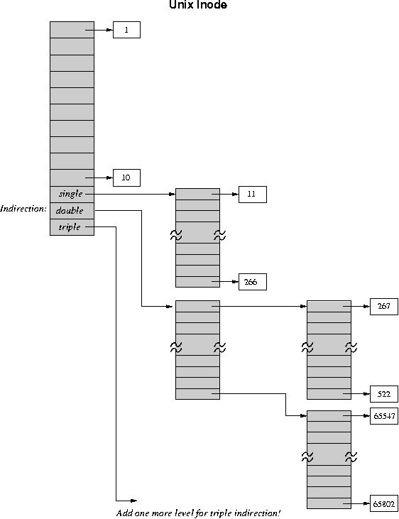
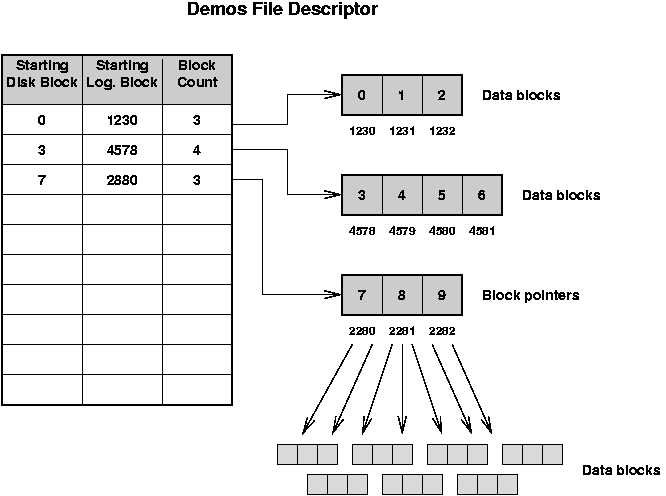

# Unix and DEMOS Disk Allocation

* * *

OSTEP: Chapter 40

Storage Management: For a given file, how the does OS find the data blocks
contained in that file?
The data structure that decribes the contents of file is generically
called a _file descriptor_.
We will see several other names (like inode and MFTE),
as we study about file systems.

The file descriptor information has to be stored on
disk, so it will stay around even when the OS does not.

- In Unix, all the descriptors are stored in a fixed
  size array on disk. The descriptors also contain
  protection and accounting information.

- A special area of disk is used
  for this (disk contains two parts: the fixed-size
  descriptor array, and the remainder, which is allocated
  for data and indirect blocks).

- The size of the
  descriptor array is determined
  when the disk is initialized, and cannot be changed. In
  Unix, the descriptor is called an _i-node_, and its
  index in the array is called its _i-number_. Internally,
  the OS uses the i-number to refer to the file.

- When a file is open, its descriptor is kept in main
  memory. When the file is closed, the descriptor is
  stored back to disk.

* * *

### The Classic Unix Inode

- File descriptors: 13 block pointers. The first 10 point to
  data blocks, the next three to indirect, doubly-indirect,
  and triply-indirect blocks (256 pointers in each indirect
  block). Maximum file length is fixed,
  but large. Descriptor space is not allocated until needed.

- Examples: block 23, block 5 block 340

- Free blocks: stored on a free list in no particular order.

- Go through examples of allocation and freeing.

- Advantages: simple, easy to implement, incremental expansion,
  easy access to small files.

- Drawbacks:

  - Indirect mechanism does not provide very efficient
    access to large files: 3 descriptor ops for each
    real operation. A cache is used, but this takes
    up main memory space.

  - Block-by-block organization of free list means that
    that file data gets spread around the disk.

* * *

### The Demos File System

Demos was an operating system written especially for high performance
systems, originally the Cray 1.
Its design continues to influence systems today.

The Demos solution: allocates files contiguously, has more
compact file descriptors, uses more CPU time. (refer to contiguous
allocation picture in section 26).

- File descriptors: select sequences of physical blocks, called _block groups_, rather
   than single blocks. Block groups were called
   _extents_ by IBM.

- A block group has three fields:
  - Starting disk block: the starting address on disk of this block group,
  - Starting logical block: the starting block number within the
     file for the block group,
  - Count: the number of blocks in the group.
- There are 10 block groups in file descriptor; if files become large, then these become
   pointers to groups of indirect blocks. The resulting
   structure is like a B-tree.

- Free blocks: described with a _bit map_. Just an array
  of bits, one per block. 1 means block free, 0 means
  block allocated. For a 300 Mbyte drive there are about
  300000 1kbyte blocks, so bit map takes up 40000 bytes.
  Keep only a small part of the bit map in memory at
  once. In allocation, scan bit map for adjacent free blocks.

- Advantages:

  - It is easy to allocate block groups, since the
    bit map automatically merges adjacent free blocks.

  - File descriptors take up less space on disk, require
    fewer accesses in random access to large files.
- Disadvantages:

  - Slightly more complex than Unix scheme: trades
    CPU time for disk access time (OK for CRAY-1).

  - When disk becomes full, this becomes VERY expensive,
    and does not get much in the way of adjacency.

Even if it is possible to allocate in groups, how do you
know when to do it? Use past history: if file is already
big, it will probably get bigger.

* * *

### What Else is Stored in an inode (File Descriptor)?

So, far, we have described the primary task of an inode to locate the data blocks
in a file.
Some of the other basic information that is found in a file descriptor includes:

**Permissions:**Indicates who can read, write or execute the file.

 **Size:**Size of the file in bytes (important because files are allocated on disk in
 terms of blocks.

 **Owner:**The user ID and other information (like group ID on UNIX) about the creator of the file.

 **Time stamps:**The time that the was created, last referenced and last modified.

* * *

If you want to learn more about how the UNIX file system next evolved, you can
check out this paper we cover in the graduate operating systems class (CS736):

> M.K McKusick,
> W. N. Joy,
> S. J. Leffler,
> R. S. Fabry,
> [A Fast File System for UNIX](http://www.cs.wisc.edu/~bart/736/papers/ffs.pdf),
> _ACM Trans. on Computer Systems_,
> **2**
> 3,
> August 1984,
> pp. 181-197.

* * *

Copyright © 2012, 2018, 2020 Barton P. Miller

Non-University of Wisconsin students and teachers are welcome
to print these notes their personal use.
Further reproduction requires permission of the author.

