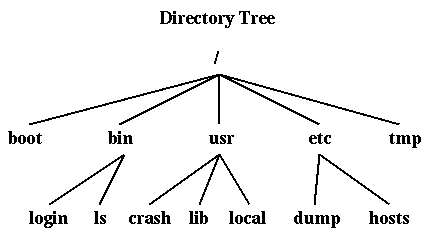
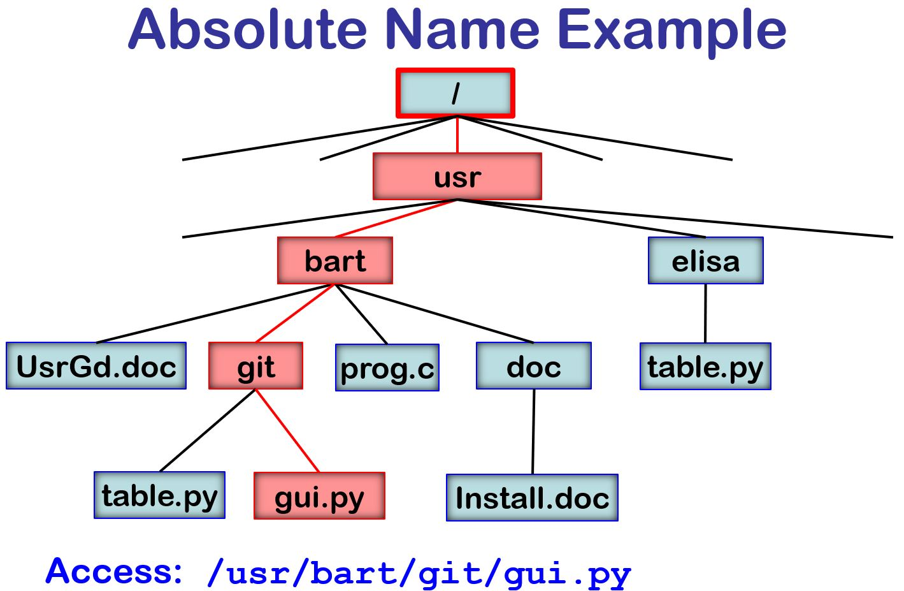
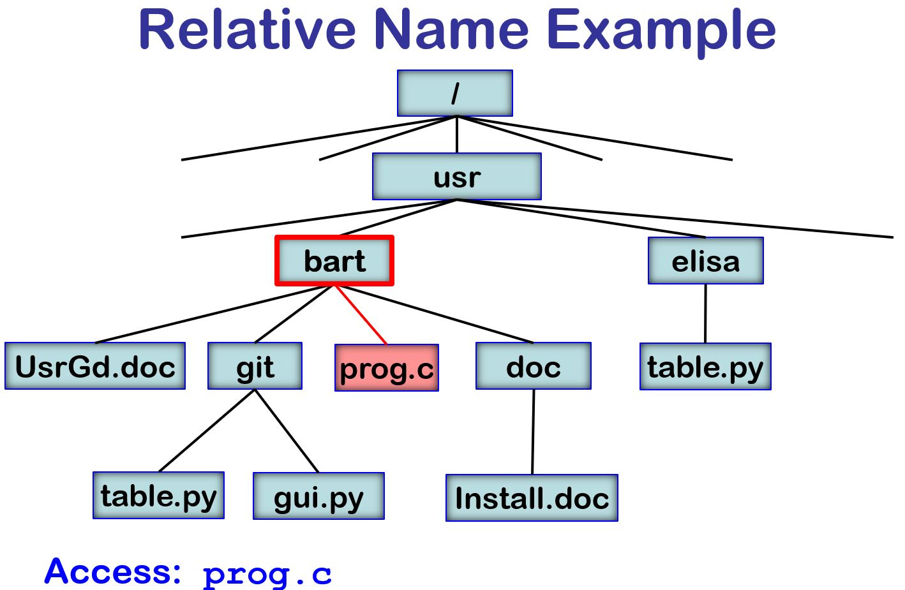

# Directories

* * *

OSTEP: Chapter 39

### Motivation

A hard concept to understand at the beginning: naming is one of
the (if not _the_) most important issues in systems design.

We know that files can be identified by their inodes (or other
type of file descriptors), and we can specify an inode by
its _i-number_, index into the inode table (or other file
table, like Master File Table on Windows), but that is not a reasonable way
for users to name files.

So, the concept of a _directory_ was developed whose basic
job is to server as a map:

> _filename_ → _inode_

Directories are just tables that contain one entry per file,
containing the file name and inode number or pointer.
Remember that other important information about a file,
such as
the owner (creator) of the file, size of the file in bytes,
and time stamps (like create, use, and modify times)
is contained in the
file descriptor (inode).

### Evolution of Directories

Over the years, we have seen an evolution on the structure of directories
and, therefore, the structure of file names.

1. Originally, systems had a single directory for the whole disk.
   Use a special area of disk to hold the directory.

   - The directory contains (name, inode) pairs.

   - If one user uses a name, no-one else can.

2. Later, operating systems had a separate directory for each user,
   plus a separate directory for "system" programs like the compilers.
   This was used in DEC's TOPS-10 operating system.
   This was still clumsy: names from different projects get confused.

3. Eventually, in the late 1960's, the Multics ("MultiplexedInformation and Computing Service")
   operating system project made a key (and huge) observation:
   **directories are just files**.
   From that simple observation, we see that if a directory is a file, then a directory can
   be contained in another directory.

   Suddenly, we have a directory tree (or graph) and file path names.
   When Thompson and Ritchie designed UNIX, they took many important ideas
   from Multics, including the directory tree,
   but pared them down to a simpler and more usable system.
   **All** modern operating systems follow this approach.

* * *

### Hierarchical Directories

Unix approach: generalize the directory structure to a tree.

This picture of a directory tree may seem like the obvious way to present file,
but it was really a major innovation by the Multics project back in the
1970's.

- Directories are stored on disk just like regular files (i.e.
  file descriptor with 13 pointers, etc.). User programs can
  read directories just like any other file (try it!). Only
  special system programs may write directories.

- Each directory contains  pairs.
  The file pointed to by the index may be another directory.
  As a result, you ewnd up with a hierarchical tree structure, name with
  /usr/local.

- There is one special directory, called the _root_. This
  directory has no name, and is the file pointed to by
  descriptor 2 (descriptors 0 and 1 have other special purposes).

### Absolute Path Names

An _absolute name_ is a name that starts at the root of the file system.
In Unix, the first character is a "/".
In Windows, the first characters are like "\\\" or "c:\\"

For example:

> `
> /usr/bart/git/gui.py
> C:\Users\bart\dev\codescanner\src\ktree.C
> `

### Current Working Directory

It is cumbersome constantly to have to specify the
full path name for all files.
So, the operating system provides a way to based file name references on
the direction in which you are working.

- There is one directory per process,
  called the _current working directory_.

- The current working directory is a property of the process
  recording in the Process Control Block for that process.

- When it gets a file name, it assumes that the file is in the
  working directory. "/" is an escape to allow full path names.

### Relative Path Names

A _relative name_ starts at the current working directory (CWD).

For example:

> `
> prog.c
> ./UsrGd.doc
> git/table.py
> git/../doc/Install.doc
> ../elisa/./table.py
> `

Note that each directory has two standard entries:
.Points to the current directory.
..Points to the parent directory.

The root directory is a special case where ".." points to the same place
as ".".

Consider the follow code sequence:

> `
> chdir("/usr/bart");
> infile = open ("prog.c", 0);
> `

This seqence would result in opening `/usr/bart/prog.c`

### Search Paths

When you are typing commands in a shell, you just type the name of the command,
like "ls".
It is the shell, not the file system, that makes it possible for the file for
that command (such as `/usr/bin/ls` to be found.

The shell mainains a user-define variable that lists the
names that of the directories that will be searched for the command named.
For example, you might set that path variable with a command like:

> `set path=(. ~/bin /s/std/bin /bin /usr/bin)`

This command tells the shell that when you type "ls", first search your
current working directory ".", then "bin" in your home directory, then
`/s/std/bin` and so on.

This set of directories is called the _search path_.
This is convenient when working on large
systems with many different programmers in different areas.

### Putting it All Together: Directories and Inodes

We have learned two important ideas:

1. Directories map from file names to inodes.

2. Inodes map from files to the data blocks in a file.

So, consider the how the operating system processes these two lines
of code

> `
> infile = open ("/a/b/c.c", 0);
> rv = read (infile, buff, 512);
> `

Let's look at the steps that the operating system goes through to
open the file and read the first bytes in the file.
Notice the numbers (in the circles) that mark each disk I/O operation.

We find the inode for the root directory because it is in a standard
position, as one of first inodes on disk.

_For simplicity, we will assume that the contents of each directory is small_
_enough to fit in one data block._

* * *

Copyright © 2013, 2018, 2020 Barton P. Miller

Non-University of Wisconsin students and teachers are welcome
to print these notes their personal use.
Further reproduction requires permission of the author.

