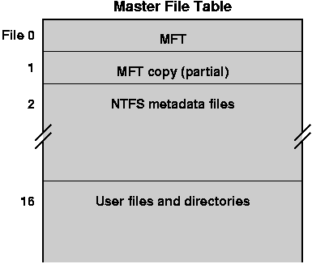
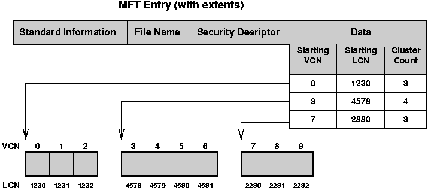
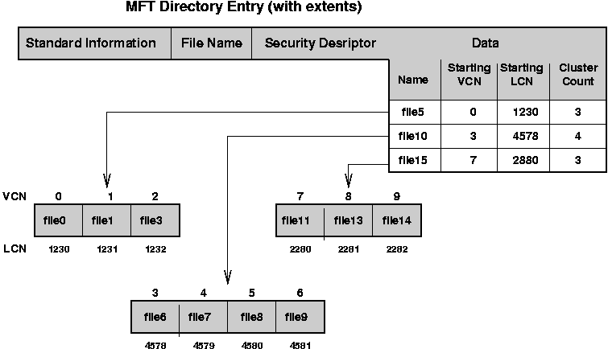

# Windows (NT) File System

* * *

Chapter 22, Section 22.5 in **Operating Systems Concepts**.

Not covered in OSTEP.

### Background

The Windows file system is called NTFS, and was introduced with Windows
NT 4.0 and is the standard file system on Windows 2000 and later systems,
such as Windows XP.
Its goal was to solve the size, performance, reliability, and flexibility
limitations in the DOS (aka "FAT" file system).

It has a general similarity to the FAT file system in that all files are
described in a single table, called the
_Master File Table_ (MFT).
However, it has more modern characteristics in that all components are files,
including:

- Master File Table
- data files
- directories

- free list (bit map)
- boot images
- recovery logs

The file system also has features to support redundancy and transactions, which we will
not discuss.
A great reference for details is the book:
**Inside the Windows NT File System** by Helen Custer, published by (not surprisingly)
Microsoft Press.

* * *

### Disk Layout

Disks are divide in fixed size regions:

- Each region is called a _volume_.

- Each volume can contain a different kind of file system, such as NTFS, FAT,
  or even Unix.

- Since each volume is a separate file system, it has its own root directory.

- Multiple volumes allow for fixed limits on the growth of a
  particular file tree, such as limiting the size of temporary file
  space.

- Multiple volumes also allow a single disk to contain multiple, separating bootable
  operating system.

* * *

### Master File Table (MFT)

Clusters are the key element to allocation:

- Logically, the disk consists of allocation units called
  **_clusters_**.

- A cluster is a power-of-two multiple of the physical disk block size.
  The cluster size is set when the disk is formatted.
  A small cluster provides a finer granularity of allocation, but may require
  more space to describe the file and more separate operations to transfer
  data to or from memory.

- The free list is a **bitmap**, each of whose bits describe one cluster.

- Clusters on the disk are numbered starting from zero to the maximum
  number of clusters (minus one).
  These numbers are called
  _logical cluster numbers_ (LCN)
  and are used to name blocks (clusters) on disk.

The MFT is the major, and in some ways, the only data structure on disk:

- All files, and therefore all objects stored on disk are described by
  the MFT.

- All files are logical stored _in_ the MFT and, for small
  files are physically within the bounds of the MFT.
  In this sense, the MFT _is_ the file system.

- The MFT logically can be described as a table with one row per file.

- The first rows in the table described important configuration files,
  including for the MFT itself.

* * *

### MFT Entries

As stated previously, each row or entry in the MFT (called a _record_)
describes a file and logically contains the file.
In the case of small files, the entry actually contains the contents of
the file.

Each entry is consists of (attribute, value) pairs.
While the conceptual design of NTFS is such that this set of
pairs is extensible to include user-defined attributes, current
version of NTFS has a fixed set.
The main attributes are:

- _Standard information:_
   This attribute includes the information that was standard in the
   MS-DOS world:

  - read/write permissions,
  - creation time,
  - last modification time,
  - count of how many directories point to this this file (hard link
     count.
- _File Name:_
   This attribute describes the file's name in the Unicode character set.
   Multiple file names are possible, such as when:

  - the file has multiple links, or
  - the file has an MS-DOS short name.
- _Security Descriptor:_
   This attribute lists which user owns the file and which users
   can access it (and how they can access it).

- _Data:_
   This attribute either contains the actual file data in the case of a
   small file or points to the data (or points to the objects that point
   to the data) in the case of larger files.

Very interesting fact:
For small files, this design is extremely efficient.
By looking no further than the MFT entry, you have the complete contents
of the file.

However, the Data field gets more complicated in the common case
where the data contained in the file
is larger than an MFT entry.
When dealing with large data, the Data attribute contains _pointers_ to
the data, rather than the data itself.

- The pointers to data are actually pointers to sequences of logical clusters
   on the disk.

- Each sequence is identified by three parts:
  - starting cluster in the file, called the _virtual cluster number_ (VCN),
  - starting logical cluster (LCN) of the sequence on disk,
  - length, counted as the number of clusters.
- The run of clusters is called an _extent_, following the terminology
   developed by IBM in the 1960's.

- NTFS allocates new extents as necessary. When there is no more space left in
   the MFT entry, then another MFT entry is allocated. This design is effectively
   a list of extents, rather than the Unix or DEMOS tree of extents.

* * *

### Directories

As with other modern file systems, a directory in NTFS is a file whose
data contains a collection of name/file mappings.

- A directory entry contains the name of the file and _file reference_.
   The file references identifies the file on this volume. In other words,
   it is an internal name for the file.

 A reference is a ( _file number_, sequence number) pair. The file
 number is the offset of the file's entry in the MFT table. It is similar
 to the Unix inumber (Inode number).

- The list of file names in the directories is not stored in a simple list,
   but rather as a lexigraphically-sorted tree, called a B+ tree (this will
   be familiar to those with a database background). The data structure is
   called an _index_ in NFTS (again, following the terminology from
   databases).

- The NTFS design specifies that an index can be constructed for any
   attribute, but currently only file name indices are supported.

- The name for a file appears both in its directory entry and in the MFT entry
   for the file itself.

- As with regular files, if the directory is small enough, it can fit
   entirely within the MFT entry.

If the directory is larger, then the
top part of (the B+ tree of) the directory is in the MFT entry,
which points to extents that contain the rest of the name/file mappings.

* * *

Copyright © 2013, 2018, 2020 Barton P. Miller

Non-University of Wisconsin students and teachers are welcome
to print these notes their personal use.
Further reproduction requires permission of the author.

