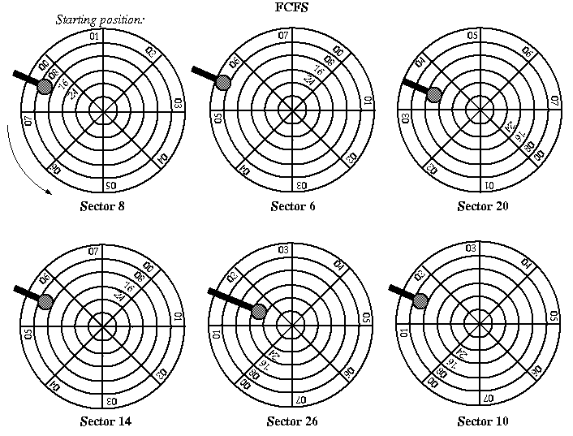
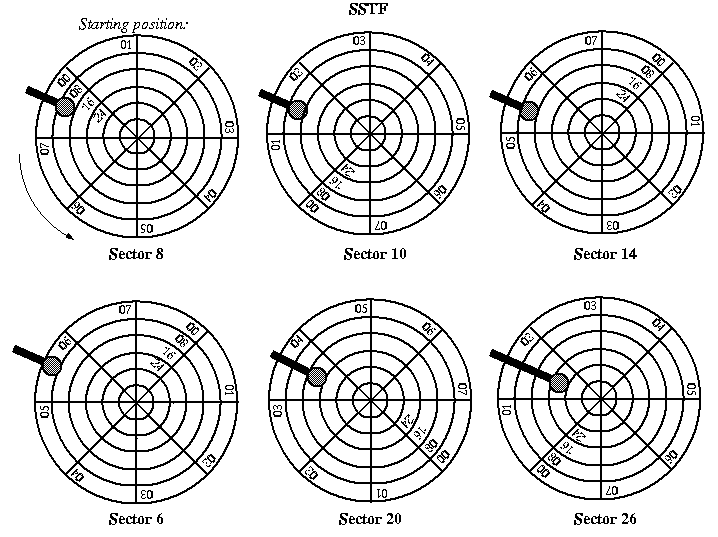
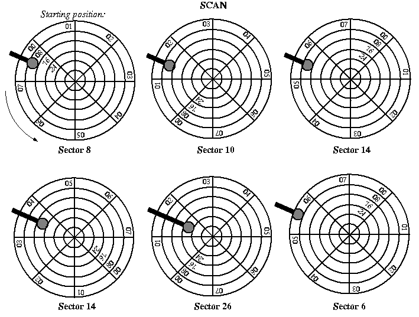

# Disk Scheduling

* * *

Chapter 12, Section 12.4 in **Operating Systems Concepts**.

Disk scheduling:
in a system with many processes running, it can often be the case that there
are several disk I/O's requested at the same time. The order in
which the requests are serviced may have a strong effect on the
overall performance of the disk.

First come first served (FIFO, FCFS): may result in a lot of
unnecessary disk arm motion under heavy loads.

Shortest seek time first (SSTF): handle nearest request first.
This can reduce arm movement and result in greater overall
disk efficiency, but some requests may have to wait a long
time.

Scan: like an elevator. Move arm back and forth, handling requests
as they are passed. This algorithm does not get hung up in any one
place for very long. It works well under heavy load, but not as
well in the middle (about 1/2 the time it will not get the shortest
seek).

* * *

Copyright © 1997, 2002 Barton P. Miller

Non-University of Wisconsin students and teachers are welcome
to print these notes their personal use.
Further reproduction requires permission of the author.

