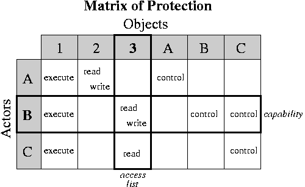

# Protection and Security

* * *

The purpose of a
protection system is to prevent accidental or
intentional misuse of a system.

- Accidents:

  Problems of this kind are easy to solve (can do things to make
  the likelihood small).

- Malicious abuse:

  Problems of this kind are very
  hard to completely eliminate (cannot leave any loopholes,
  cannot play on probabilities).

There are three aspects to a protection mechanism:

- **User identification (authentication)**: make sure we know who is doing what.

- **Authorization determination**: must figure out what the user
  is and is not allowed to do. Need a simple database for this.

- **Access enforcement**: must make sure there are no loopholes
  in the system.

Even the slightest flaw in any of these areas may ruin the whole
protection mechanism.

* * *

### Authentication

Modern authentication is based on a
**three factor** model:
(1) what you have,
(2) what you are, and
(3) what you know.

**What you know:**
This means some sort of
_password_
or
_PIN_
number.
Passwords are commonly used by themselves and so are a relatively week
form of authentication.

- Passwords should not be stored in a readable form.
   One-way transformations should be used.

- Passwords should be relatively long and obscure.
   _Paradox:_
  _short passwords are easy to guess or crack; long passwords are easily_
  _forgotten and usually written down._

**What you have:**
This means some sort physical device that you hold.
It should be something that is difficult for forge or copy and,
if stolen, is hard to use.
Some examples:

- A physical key: often easy to copy, and easy to use if stolen.

- An identification badge: moderate to difficult to copy and easy to use if
  stolen.

- Crypto card or app:
  generates one-time use keys. Difficult (not impossible) to copy of the
  chips are designed to be tamper resistant.
  The addition of a PIN number for the device makes it hard to use if stolen (this
  is effectively adding a second factor).

**What you are:**
this means using physical data about your body, called
_biometrics_.
It might be a finger or hand print, retinal scan, facial recognition, or even
weight (or some combination of these).

- Fingerprint readers are now common, found on lots of smart phones and
  laptop computers.
  Finger or hand print readers are common in secure environments.
  For example, U.S. Customs and Border Protection uses finger prints
  for both frequent travelers (the Global Entry system) and foreign visitors.

- CERN uses retinal scans to restrict access to their
  underground accelerator beam tunnel.

- Some secure environments will weigh you as you enter or exit to see if
  that is consistent with your records.
  (Lots of false alarms after the holidays!)

You use two or three factor authentication for stronger security.
Just using one factor alone has significant weakness.
The most secure environments use all three factors, which means that the
tricks that you have seen in the James Bond movies would not work that
well in the real world.

* * *

Once identification is complete, the system must be sure to protect
the identity since other parts of the system will rely on it.

### Authorization Determination

Must indicate who is allowed to do
what with what. Draw the general form as an access matrix with one row
per user, one column per file. Each entry indicates the
privileges of that user on that object. There are two general ways of
storing this information: _access lists_ and _capabilities_.

Access Lists: with each file, indicate which users are allowed
to perform which operations.

- In the most general form, each file has a list
  of  pairs.

- It would be tedious to have a separate
  listing for every user, so they are usually grouped into classes.
  For example, in Unix there are three classes: self, group, anybody
  else (nine bits per file).

- Access lists are simple, and are used in almost all file systems.

Capabilities: with each user, indicate which files may be accessed,
and in what ways.

- Store a list of  pairs with each user.
  This is called a _capability list_.

- Typically, capability systems use a different naming
  arrangement, where the capabilities are the only names
  of objects. You cannot even name objects not referred to in
  your capability list.

- In access-list systems, the default is usually for everyone
  to be able to access a file. In capability-based systems, the
  default is for no-one to be able to access a file unless they
  have been given a capability. There is no way of even naming
  an object without a capability.

- Capabilities are usually used in systems that need to be very secure.
  However, capabilities can make it difficult to share information:
  nobody can get access to your stuff unless you explicitly give
  it to them.

Are the following things access-based or capability-based
protection schemes?

- Protection Keys

- Page tables

* * *

### Access Enforcement

Some part of the system must be responsible
for enforcing access controls and protecting the authorization and
identification information.

- Obviously, this portion of the system must run unprotected.
  Thus it should be as small and simple as possible. Example:
  the portion of the system that sets up memory mapping
  tables.

- The portion of the system that provides and enforces
  protection is called the _security kernel_. Most
  systems, like Unix, do not have a security kernel. As
  a consequence, the systems are not very secure.

- What is needed is a hierarchy of levels of protection, with each
  level getting the minimum privilege necessary to do its job.
  However, this is likely to be slow (crossing levels takes time).

* * *

Copyright © 2010, 2013 Barton P. Miller

Non-University of Wisconsin students and teachers are welcome
to print these notes their personal use.
Further reproduction requires permission of the author.

