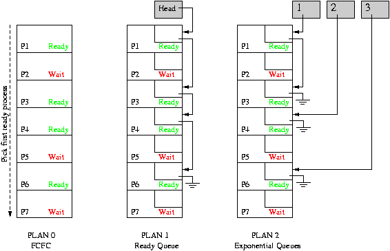
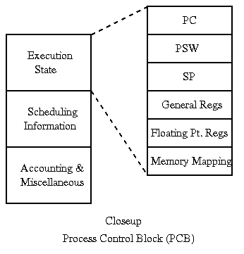
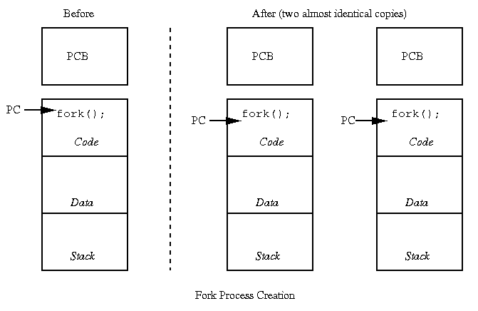

# 3: Dispatching, Creating Processes

* * *

OSTEP: Chapter 4 (fork and exec).

OSTEP: Chapter 5.

How does the operating system decide which process to run next?
It's a two part operation, seperating the policy (in the _scheduler_)
from the mechanism (in the _dispatcher_).

**Scheduler:** Make decisions based on process and user priorities, and past process behavior, as
to which processes to run next.
We'll study this more in
[Lecture 11](s11.md) on CPU scheduling.

**Dispatcher:** Implements the scheduler's decisions.
This means the mechanisms to collect the necessary performance data for the schedule, quickly finding
the net process to run, and actually switching to the next process.

So, how does dispatcher decide which process to run next?

- Plan 0: search process table from front, run first runnable process.
  - Might spend a lot of time searching.

  - Weird priorities.
- Plan 1: link together the runnable processes into a queue. Dispatcher
  grabs first process from the queue. When processes become runnable,
  insert at back of queue.

- Plan 2: give each process a priority, organize the queue according
  to priority. Or, perhaps have multiple queues, one for each
  priority class.

CPU can only be doing one thing at a time: if user process is executing,
dispatcher is not: OS has lost control. How does OS regain control
of processor?

Internal events (things occurring within user process):

- System call.

- Error (illegal instruction, addressing violation, etc.).

- Page fault.

These are also called _traps_. They all cause a state switch
into the OS.

External events (things occurring outside the control of the
user process):

- Character typed at terminal.

- Completion of disk operation (controller is ready for more work).

- Timer: to make sure OS eventually gets control.

External events are usually called _interrupts_. They all
cause a state switch into the OS.
_This means that user processes cannot directly take I/O interrupts_.

* * *

When process is not running, its state must be saved in
its process control block.
What gets saved? Everything that next process could trash:

- Program counter.

- Processor status word (condition codes, etc.).

- General purpose registers.

- Floating-point registers.

- All of memory?

How do we switch contexts between the user and OS? Must be careful
not to mess up process state while saving and restoring it.

Saving state: it is tricky because the the OS needs some state
to execute the state saving and restoring code.

- Hand-code in assembler: avoid using registers that contain
  user values.

- Still have problems with things like PC and PS: cannot do
  either one without the other.

- All machines provide some special hardware support for
  saving and restoring state:
  - Most modern processors: hardware does not know much about processes, it
     just moves PC and PS to/from the stack. OS then transfers
     to/from PCB, and handles rest of state itself.
     (We will see processor knowledge about processes when we discuss virtual
     memory.)

  - Exotic processors, like the
     Intel 432: hardware did all state saving and restoring
     into process control block, and even dispatching.

Short cuts: as process state becomes larger and larger,
saving and restoring becomes more and more expensive.
Cannot afford to do full save/restore for every little
interrupt.

- Sometimes different amounts are saved at different times.
  E.g. to handle interrupts, might save only a few registers,
  but to swap processes, must save everything. This is a
  performance optimization that can cause BIZARRE problems.

- Sometimes state can be saved and restored incrementally,
  e.g. in virtual memory environments.

* * *

Creating a process from scratch (e.g., the Windows `CreateProcess`):

- Load code and data into memory.

- Create (empty) call stack.

- Create and initialize process control block.

- Make process known to dispatcher.

Forking: want to make a copy of existing process (e.g., Unix/Linux).

- Make sure process to be copied is not running and has
  all state saved.

- Make a copy of code, data, stack.

- Copy PCB of source into new process.

- Make process known to dispatcher.

What is missing?

For an interesting perspective on fork, check out this recent paper.
Note that I don't agree with many of their arguments:

> Andrew Baumann, Jonathan Appavoo, Orran Krieger and Timothy Roscoe,
> [A\
> fork() in the Road](http://www.cs.wisc.edu/~bart/736/papers/fork-hot_os19.pdf),
> _18th Workshop on Hot Topics in Operating Systems (HotOS'19),_
> Bertinoro, Italy, May 2019.
> https://doi.org/10.1145/3317550.3321435.

* * *

Copyright © 2018, 2020 Barton P. Miller

Non-University of Wisconsin students and teachers are welcome
to print these notes their personal use.
Further reproduction requires permission of the author.

