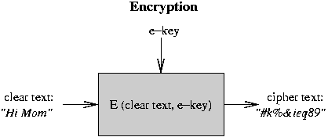

# Security Improvements, Encryption

* * *

### Security Improvements

Solutions: nothing works perfectly, but here are some possibilities:

- Logging: record all important actions and uses of privilege
   in an indelible file. Can be used to catch imposters during
   their initial attempts and failures. E.g. record all attempts
   to specify an incorrect password, all super-user logins.
   Even better is to get humans involved at key steps (this is
   one of the solutions for EFT).

- Principle of minimum privilege ("need-to-know" principle):
   each piece of the system has access to the minimum amount
   of information, for the minimum possible amount of time.
   E.g. file system cannot touch memory map, memory manager
   cannot touch disk allocation tables. This reduces the chances
   of accidental or intentional damage. Note that capabilities
   are an implementation of this idea. It is very hard to provide
   fool-proof information containment: e.g. a trojan horse could
   write characters to a tty, or take page faults, in Morse code,
   as a signal to another process.

- Correctness proofs. These are very hard to do. Even so,
   this only proves that the system works according to spec.
   It does not mean that the spec. is necessarily right, and
   it does not deal with Trojan Horses.

* * *

### Encryption

Key technology: encryption. Store and transmit information
in an encoded form that does not make any sense.

The basic mechanism:

- Start with text to be protected. Initial readable text
   is called _clear text_.

- Encrypt the clear text so that it does not make any sense
   at all. The nonsense text is called _cipher text_.
   The encryption is controlled by a secret password
   or number; this is called the _encryption key_.

- The encrypted text can be stored in a readable file, or
   transmitted over unprotected channels.

- To make sense of the cipher text, it must be _decrypted_
   back into clear text. This is done with some other algorithm
   that uses another secret password or number, called the
   _decryption key_.

All of this only works under three conditions:

- The encryption function cannot
   easily be inverted (cannot get back to clear text unless
   you know the decryption key).

- The encryption and
   decryption must be done in some safe place so the clear text
   cannot be stolen.

- The keys must be protected. In most systems, can compute one
   key from the other (sometimes the encryption and decryption
   keys are identical), so cannot afford to let either key leak
   out.

Public key encryption: new mechanism for encryption where
knowing the encryption key does not help you to find decryption
key, or vice versa.

- User provides a single password, system
   uses it to generate two keys (use a one-way function, so cannot
   derive password from either key).

- In these systems, keys are inverses of each other: could just
   as easily encrypt with decryption key and then use encryption
   key to recover clear text.

- Each user keeps one key secret, publicizes the other. Cannot
   derive private key from public. Public keys are made available
   to everyone, in a phone book for example.

Safe mail:

- Use public key of destination user to encrypt mail.
- Anybody can encrypt mail
   for this user and be certain that only the user will be
   able to decipher it.

It is a nice scheme because the
user only has to remember one key, and all senders can use
the same key. However, how does receiver know for sure who
it is getting mail from?

* * *

### Digital Signatures

Positive identification: can also use public keys to certify
identity:

- To certify your identity, use your private key to encrypt
   a text message, e.g. "I agree to pay Mary Wallace $100
   per year for the duration of life."

- You can give the encrypted message to anybody, and they
   can certify that it came from you by seeing if it decrypts
   with your public key. Anything that decrypts into readable
   text with your public key _must_ have come from you!
   This can be made legally binding as a form of electronic
   signature.

This is really even better than signatures: harder to forge,
and can change if compromised. Note that this idea was developed
by an undergraduate (Loren Kohnfelder) in 1978 as part of his
undergraduate thesis (at MIT).

These two forms of encryption can be combined together.
To identify sender in secure mail, encrypt first with
your private key, then with receiver's public key. The
encryption/decryption functions to send from B to A are:

Encryption appears to be a great way to thwart listeners.
It does not help with Trojan Horses, though.

Old dederal Data Encryption Standard (DES). Is not public-key
based, but as implemented efficiently and appeared to
be _relatively_ safe.

More recently, there is the Advanced Encryption Standard (AES), called Ryndal (pronounced
"rine doll").
\*\*\*more on AES here\*\*\*\*

General problem: how do we know that an encryption mechanism
is safe? It is extremely hard to prove.

This is a hot topic for research: theorists are trying
to find provably hard problems, and use them for proving
safety of encryption.

Summary of Protection: very hard, but is increasingly important
as things like electronic funds transfer become more and more
prevalent.

* * *

Copyright © 2010, 2013 Barton P. Miller

