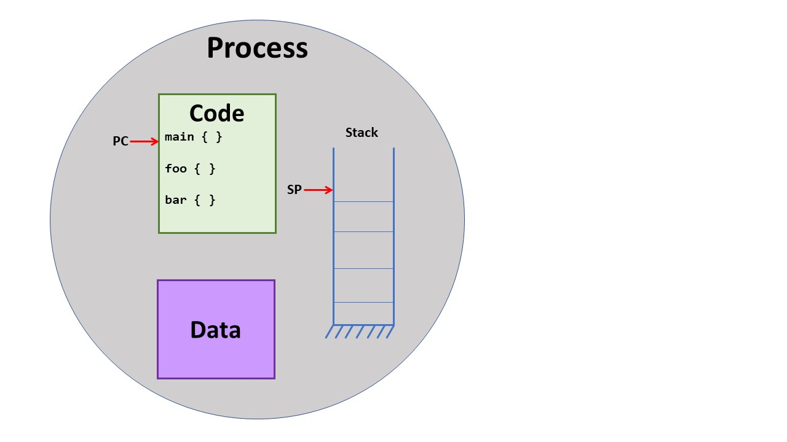
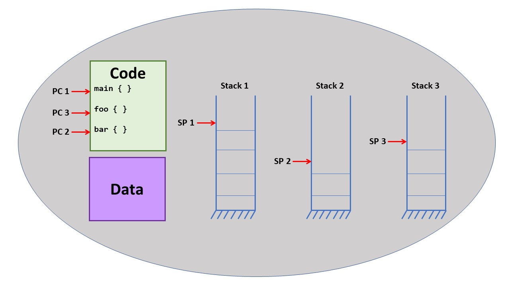

#3A: Processes and Threads

* * *

## Processes

Two important aspects of a **Process** are its execution state and the memory that it
can access.
The execution state includes the processors registers, including the program counter (PC)
and stack pointer (SP).
The PC (sometimes called the "instruction pointer") defines where in the code the process
is executing and the stack pointer defines the location of where the process is currently
accessing the stack.
This execution state defines what we call a "thread of execution"; in other words, where
the process is executing in the code.

The memory that a process can access is called its **address space**.
In all modern operating systems, each process has a separate address space and the
OS enforces the separation of these address spaces so that no process can modify
the memory of another process.
In the Memory Management part of the course, we will learn about how the OS
tracks each process' address space and enforces the separation.

Here we can see a process with its address space (code, data, stack) and one
thread of execution, where the thread of execution is defined by the program
counter, stack pointer, and processor registers.
This is the kind of process structure that you get when creating a process
with the `fork` system call on Unix and the `CreateProcess`
system call on Windows.

Up to this point, you have probably thought about programming in a
strictly sequential, independent way, just like shown in the figure above.
That is, each program that you have run (i.e, each process) is separate from anything
else running on the computer, and the program executes step by step through the code.
So, each program runs in its own address space with on thread of execution.

As we will study in the next lecture sections, programmers want to be able to
run multiple threads of execution that share the same data.
These multiple threads of execution might be used to allow parallel execution
based on multiple CPU cores or be used as a way to structure the program
in a natural way.
A process with multiple threads of execution might look like this:

Each thread of execution had it own stack and copy of the registers, but
shared the same code and data.

## Threads vs. Lightweight Processes

We are now going to discuss the distinction between threads of execution
supported inside the operating system and those supported at user level.
This distinction can come across as subtle and confusing but is of great import.

### Threads

Historically, operating systems did not allow multiple processes to share
the same address space.
There was one thread of execution per address space, like the first figure
above.
However, programmers wanted to have multiple threads of execution, so they
created a _user-level_ abstraction, called a **thread** in the UNIX
world, to support this need.
Basically, they created a thread library that links with your program.
This library has some sort of create function that would be called in
the following manner:

> `tid = ThreadCreate(StartFunc)`

This function does the following:

1. Allocate a new entry in the library's Thread Table.
    This table entry will contain, among other things, the value of the
    CPU registers for this thread (including PC and SP) when the thread
    is not running.

2. Assign the new thread a Thread ID (tid).
    This value is also stored in the thread table entry.

3. Set the starting address of the thread's execution to the address of the
    function paradyn `StartFunc` passed as a parameter to `ThreadCreate`
4. Last, either return to the calling thread or save the calling thread's state
    in its Thread Table entry and dispatch a new thread.

In addition to thread creation, the library will also have functions to wait for
a thread to complete (often called _join_), do synchronization such as with
semaphores, or terminate the current thread.

The thread library takes care of saving and restoring registers and deciding
what thread runs next.
You can look at the Linux manual for
`setjmp`
and
`longjump`
to see library functions that can help you write the thread context switch code.

The operating system is unaware that there are threads running in the process.
This approach to creating thread is simple and switching between threads can
be very quick.
These thread libraries are easy to write, so there were hundreds of
different thread libraries written in the 1970's and 1980's.
In fact, this was a common operating systems programming project.
As a result, you can quickly design one for you own specific needs.

However, there are disadvantages to such a user-level thread library.
First, consider the case where one of the threads does an operation that will cause the
OS to block the function, such as reading from the terminal or waiting for a network
packet.
Such a read or receive operation would be a system call that would enter the
OS kernel.
When the OS decided that the process would block, it would be taken off the ready
queue (no longer be runable).
As a result, _all_ the threads in the process would block, perhaps
unnecessarily.

Second, note that even though your process has multiple threads, and perhaps is
running on a multi-core CPU, you do not get parallelism.
There is only on OS process, so only one OS-schedulable entity.
You could have a 100 threads running in your process, but only one at a time
would get to execute.

### Lightweight Processes

Operating system designers knew that they need to add the ability to have
processes share the same memory, i.e., the same address space.
So, they created version of the process-create function that would keep the
same memory as the existing process, but allocate a new kernel-schedulable process
that ran in the same address space.
This means that the kernel allocated a new Process Table entry (PCB), but
pointed this process at the same memory as the existing process.
Since these processes are somewhat faster to create (because memory already
is allocated and loaded),
they were called
**lightweight processes** (LWP).

So, now you have multiple threads of execution in the process in the form
of LWP's and the operating system is aware of each of these LWP's.
So, when one LWP blocks, the others can continue.
And because the OS is scheduling each LWP, they can be scheduled on separate
CPU cores, resulting in true parallelism.
These are important benefits.

However, similar to our discussion of threads, there are two disadvantages
when using LWPs.
First, while they are faster to create than full processes (each with its own
address space), they are still much slower than creating a user-level thread.
Second, since the LWP interface is defined by the operating system, it is fixed
and unlikely to change or adapt to a particular use-case or need.

### Threads + Processes

And now, we will bring the two concepts of threads and lightweight processes together
because that represents the way that current operating systems and programming languages
actually work.
This layering of threads on top of LWPs
is important but unfortunately it is the part that is most confusing to understand.
The result of bringing these together is that you get the advantages of LWPs, in that
they are visible to the kernel and scheduled by the kernel, and the advantages
of user-level threads, in that you can easily write your own library with an
interface to match your needs.

The user typically interacts with the thread library, such as pthreads
(implemented as the Native POSIX Thread Library (NPTL) or
[OpenMP](https://www.openmp.org/), and
this library makes use of the the lightweight processes to create the threads of
execution.

## Terminology

Unfortunately, as with many things in computer science, there are multiple terms
for the same concept used by different system.
In the table below, we can see a comparison of the terminology just for UNIX (including
Linux, of course) and Windows.
Most notably, what UNIX calls a "lightweight process", Windows calls a "thread";
nd what UNIX calls a "thread", Windows calls a "fiber".

Commonly Used Terminology and Corresponding System/Library CallsUNIXWindows
A kernel-supported process with its own address space

Process

`fork`
Process

`CreateProcess`
A kernel-supported process sharing its address space with
other processes

Lightweight Process

`clone`
Thread

`CreateThread`
A user-level thread of execution in a process

Thread

`pthread_create`
Fiber

`CreateFiber`

* * *

Copyright © 2020 Barton P. Miller.
All rights reserved.

