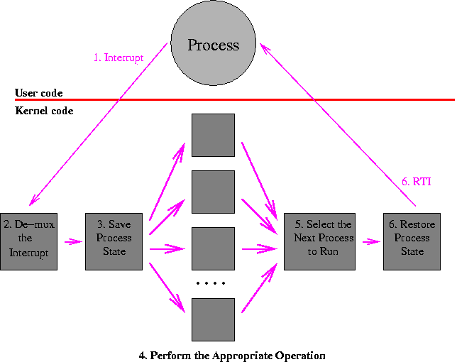
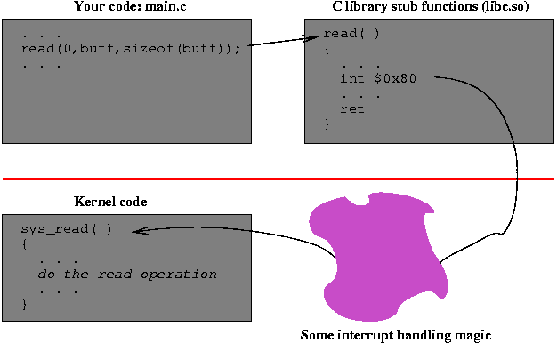

# Chapter 3B
## User and Kernel Addresse Spaces

In a modern operating system,
each user process runs in its own address space, and the kernel
operates in its protected space.
At the processor level (machine code level),
the main distinction between the kernel and a user process is the ability to
access certain resources such as executing privileged instructions,
reading or writing special registers, and accessing certain memory locations.

The separation of user process from user process insures that each processes
will not disturb each other.
The separation of user processes from the kernel insures that users processes
will not be able to arbitrarily modify the kernel or jump into its code.
It is important that processes cannot read the kernel's memory, and that it
cannot directly call any function in the kernel.
Allowing such operations to occur would invalidate any protection that the
kernel wants to provide.

Operating systems provide a mechanism for selectively calling certain
functions in the kernel.
These select functions are called
_kernel calls_
or
_system calls_, and act as
gateways into the kernel.
These gateways are carefully designed to provide safe functionality.
They carefully check their parameters and understand how to move
data from a user process into the kernel and back again.
We will discuss this topic in more detail in the Memory Management section
of the course.

* * *

## The Path In and Out of the Kernel

The _only_ way to enter the operating kernel is to generate a processor interrupt.
Note the emphasis on the word "only".
These interrupts come from several sources:

- _I/O devices:_
  When a device, such as a disk or network interface, completes its current
  operation, it notifies the operating system by generating a processor interrupt.

- _Clocks and timers:_
  Processors have timers that can be periodic (interrupting on a
  fixed interval) or count-down (set to complete at some specific time
  in the future).
  Periodic timers are often used to trigger scheduling decisions.
  For either of these types of timers, an interrupt is generated to get the
  operating system's attention.

- _Exceptions:_
  When an instruction performs an invalid operation, such as divide-by-zero,
  invalid memory address, or floating point overflow, the processor can generate
  an interrupt.

- _Software Interrupts (Traps):_
  Processors provide one or more instructions that will cause the processor to
  generate an interrupt.
  These instructions often have a small integer parameter.
  Trap instructions are most often used to implement system calls and to be
  inserted into a process by a debugger to stop the process at a breakpoint.


The flow of control is as follows (and illustrated below):

1. The general path goes from the executing user process to the interrupt
   handler.
   This step is like a forced function call, where the current PC and processor
   status are saved on a stack.

2. The interrupt handler decides what type of interrupt was generated
   and calls the appropriate kernel function to handle the interrupt.

3. The general run-time state of the process is saved (as on a context
   switch).

4. The kernel performs the appropriate operation for the system call.
   This step is the "real" functionality; all the steps before and after
   this one are mechanisms to get here from the user call and back again.

5. if the operation that was performed was trivial and fast, then the kernel
   returns immediately to the interrupted process.
   Otherwise,
   sometime later (it might be much later), after the operation is complete,
   the kernel executes its short-term scheduler (dispatcher) to pick the next
   process to run.


   Note that one side effect of an interrupt might be to terminate the currently
   running process.
   In this case, of course, the current process will never be chosen to run
   next!

6. The state for the selected process is loaded into the
   registers and control is transferred to the process using some type of
   "return from interrupt" instruction.




* * *

## The System Call Path

One of the most important uses of interrupts, and one of the least obvious
when you first study about operating systems, is the system call.
In your program, you might request a UNIX system to read some data from a
file with a call that looks like:

> `rv = read(0,buff,sizeof(buff));`

Somewhere, deep down in the operating system kernel, is a function that
implements this read operation.
For example, in Linux, the routine is called `sys_read()`.

The path from the simple `read()` function call in your program to the
`sys_read()` routine in the kernel takes you through some interesting
and crucial magic.
The path goes from your code to a system call
_stub_ function that contains a trap or interrupt instruction,
to an interrupt handler in the kernel,
to the actual kernel function.
The return path is similar, with the addition of
some important interactions with the process dispatcher.



* * *

## System Call Stub Functions

The system call stub functions
provide a high-level language interface to a function whose
main job is to generate the software interrupt (trap) needed to get
the kernel's attention.
These functions are often called _wrappers_.

The stub functions on most operating systems do the same basic steps.
While the details of implementation differ, they include the following:

1. set up the parameters,
2. trap to the kernel,
3. check the return value when the kernel returns, and
   1. if no error: return immediately, else
   2. if there is an error: set a global error number variable
       (called "errno") and return a value of -1.

Below are annotated examples of this code from both the Linux (x86) and
Solaris (SPARC) version of the C library.
As an exercise, for the Linux and Solaris versions of the code, divide the code
into the parts described above and label each part.

**x86 Linux read (glibc 2.1.3)**

```
read:       push   %ebx
            mov    0x10(%esp,1),%edx           ; put the 3 parms in registers
            mov    0xc(%esp,1),%ecx
            mov    0x8(%esp,1),%ebx
            mov    $0x3,%eax                   ; 3 is the syscall # for read
            int    $0x80                       ; trap to kernel
            pop    %ebx
            cmp    $0xfffff001,%eax            ; check return value
            jae    read_err
read_ret:   ret                                ; return if OK.
read_err:   push   %ebx
            call   read_next                   ; push PC on stack
read_next:  pop    %ebx                        ; pop PC off stack to %ebx
            xor    %edx,%edx                   ; clear %edx
            add    $0x49a9,%ebx                ; the following is a bunch of
            sub    %eax,%edx                   ; ...messy stuff that sets the
            push   %edx                        ; ...value fo the errno variable
            call   0x4000dfc0 <__errno_location>
            pop    %ecx
            pop    %ebx
            mov    %ecx,(%eax)
            or     $0xffffffff,%eax            ; set return value to -1
            jmp    read_ret                    ; return

```

**SPARC Solaris 8**

```
read:       st     %o0,[%sp+0x44]            ! save argument 1 (fd) on stack
read_retry: mov    3,%g1                     ! 3 is the syscall # for read
            ta     8                         ! trap to kernel
            bcc    read_ret                  ! branch if no error
            cmp    %o0,0x5b                  ! check for interrupt syscall
            be,a   read_retry                ! ... and restart if so
            ld     [%sp+0x44],%o0            ! restore 1st param (fd)
            mov    %o7,%g1                   ! save return address
            call   read_next                 ! set %o7 to PC
            sethi  %hi(0x1d800), %o5         ! the following is a bunch of
read_next:  or     %o5, 0x10, %o5            ! ...messy stuff that sets the
            add    %o5,%o7,%o5               ! ...value of the errno variable
            mov    %g1, %o7                  ! ...by calling _cerror.  also the
            ld     [%o5+0xe28],%o5           ! ...return value is set to -1
            jmp    %o5
            nop
read_ret:   retl
            nop

```

* * *

## Interrupt Handling and the Interrupt Vector

When an interrupt occurs, the hardware takes over and forces a control
transfer that looks much like a function call.
The destination of the control transfer depends on the type of
interrupt.
Interrupt types include things such as divide by zero, memory errors,
and software interrupts (such as from the "int" instruction).
The code that handles a particular type of interrupt is called (cleverly
enough) an
_interrupt handler_.
As control is transferred to the appropriate interrupt handler, the
process saves the
PC and processor status on a special kernel stack.

The operating system sets up a table, usually called the
_interrupt vector_, that contains one entry per type of interrupt.
On the x86, this table is called the
_Interrupt Descriptor Table_ and an entry in the table is called
a _gate_.
Each vector entry contains the address of the interrupt handler for
its interrupt.

In addition to branching and saving the PC and processor status,
the processor will switch from a state where only
certain parts of memory can be accessed and where certain instructions
are prohibited ( _user mode_) to a state where all operations
are permitted ( _system mode_).

* * *

## Saving State and Invoking the Kernel Function

Below is a _slightly_ simplified version of the Linux code that is
called to handle a system call trap.

The first part of the code (starting at `system_call`)
saves the registers of the user process and plays around with the
memory management registers so that the kernel's
internal data is accessible.
It also finds the process table entry for this user process.

The trap instruction that caused the entry to the kernel has a
parameter that specifies which system call is being invoked.
The code starting at `do_call` checks to see if this
number is in range, and then calls the function associated with
this system call number.
When this function returns, the return value (stored in the eax
register) is saved in the place where all the other user registers
are stored.
As a result, when control is transferred from the kernel back to the
user process, the return value will be in the right place.

After the system call is complete, it is time to return to the user
process.
There are two choices at this point: (1) either return directly the the
user process that made the system call or (2) go through the dispatcher
to select the next process to run.

`ret_from_sys_call`

```
system_call:
        #
        #----Save orig_eax: system call number
        #    used to distinguish process that entered
        #    kernel via syscall from one that entered
        #    via some other interrupt
        #
        pushl %eax

        #
        #----Save the user's registers
        #
        pushl %es
        pushl %ds
        pushl %eax
        pushl %ebp
        pushl %edi
        pushl %esi
        pushl %edx
        pushl %ecx
        pushl %ebx

        #
        #----Set up the memory segment registers so that the kernel's
        #    data segment can be accessed.
        #
        movl $(__KERNEL_DS),%edx
        movl %edx,%ds
        movl %edx,%es

        #
        #----Load pointer to task structure in EBX. The task structure
	#    resides below the 8KB per-process kernel stack.
        #
        movl $-8192, %ebx
        andl %esp, %ebx

        #
        #----Check to see if system call number is a valid one, then
        #    look-up the address of the kernel function that handles this
        #    system call.
        #
do_call:
        cmpl $(NR_syscalls),%eax
        jae badsys
        call *SYMBOL_NAME(sys_call_table)(,%eax,4)

	# Put return value in EAX of saved user context
        movl %eax,EAX(%esp)

        #
        #----If we can return directly to the user, then do so, else go to
        #    the dispatcher to select another process to run.
        #
ret_from_sys_call:
        cli        # Block interrupts; iret effectively re-enables them
        cmpl $0,need_resched(%ebx)
        jne reschedule

        # restore user context (including data segments)
        popl %ebx
        popl %ecx
        popl %edx
        popl %esi
        popl %edi
        popl %ebp
        popl %eax
        popl %ds
        popl %es
        addl $4,%esp                   # ignore orig_eax
        iret

reschedule:
        call SYMBOL_NAME(schedule)
        jmp ret_from_sys_call

```

* * *

Copyright © 2015, 2018 Barton P. Miller

