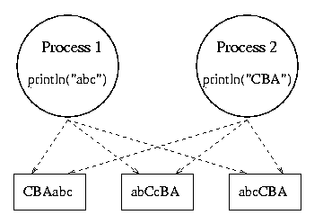
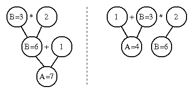

# Independent and Cooperating Processes

* * *

OSTEP: Chapter 26

Independent process: one that is independent
of the rest of the universe.

- Its state is not shared in any way by any other process.

- Deterministic: input state alone determines results.

- Reproducible.

- Can stop and restart with no bad effects (only time varies).

Example: program that sums the integers from 1 to i (input).

There are many different ways in which a collection of independent
processes might be executed on a processor:

- Uniprogramming: a single process is run to completion before anything
  else can be run on the processor.

- Multiprogramming: share one processor among several processes.
  If no shared state, then order of dispatching is irrelevant.

- Multiprocessing: if multiprogramming works, then it should also
  be ok to run processes in parallel on separate processors.

  - A given process runs on only one processor at a time.

  - A process may run on different processors at different times
     (move state, assume processors are identical).

  - Cannot distinguish multiprocessing from multiprogramming on a very
     fine grain.

How often are processes completely independent of the rest of
the universe?

* * *

Cooperating processes:

- Machine must model the social structures of the people that
  use it. People cooperate, so machine must support that
  cooperation. Cooperation means shared state, e.g. a
  single file system.

- Cooperating processes are those that share state.
  (May or may not actually be "cooperating")

- Behavior is _nondeterministic_: depends on relative
  execution sequence and cannot be predicted a priori.

- Behavior is _irreproducible_.

- Example: one process writes "ABC", another writes "CBA".

When discussing concurrent processes, multiprogramming is as
dangerous as multiprocessing unless you have tight control over
the multiprogramming. Also bear in mind that smart I/O devices
are as bad as cooperating processes (they share the memory).

Why permit processes to cooperate?

- Want to share resources:
  - One computer, many users.

  - One database of checking account records, many tellers.
- Want to do things faster:
  - Read next block while processing current one.

  - Divide job into sub-jobs, execute in parallel.
- Want to construct systems in modular fashion.
  (e.g. tbl \| eqn \| troff)

* * *

Basic assumption for cooperating process systems is that
the order of some operations is irrelevant; certain operations
are completely independent of certain other operations.
Only a few things matter:

- Example: A = 1; B = 2; has same result as B = 2; A = 1;

- Another example: A = B+1; B = 2\*B cannot be re-ordered.

_Race conditions_: Suppose A=1 and A=2 are executed in parallel?

_Atomic operations_:
Before we can say ANYTHING about parallel processes, we must
know that some operation is _atomic_, i.e. that it either
happens in its entirety without interruption, or not at all.
Cannot be interrupted in the middle. E.g. suppose that
println is atomic -- what happens in println("ABC"); println("BCA")
example?

- References and assignments are atomic in almost all systems.
  A=B will always get a good value for B, will always
  set a good value for A (not necessarily true for arrays,
  records, or even floating-point numbers).

- In uniprocessor systems, anything between interrupts
  is atomic.

- If you do not have an atomic operation, you cannot make one.
  Fortunately, the hardware folks give us atomic ops.

- If you have any atomic operation, you can use it to
  generate higher-level constructs and make parallel programs
  work correctly. This is the approach we will take in this class.

* * *

Copyright © 2011, 2018 Barton P. Miller

Non-University of Wisconsin students and teachers are welcome
to print these notes their personal use.
Further reproduction requires permission of the author.

