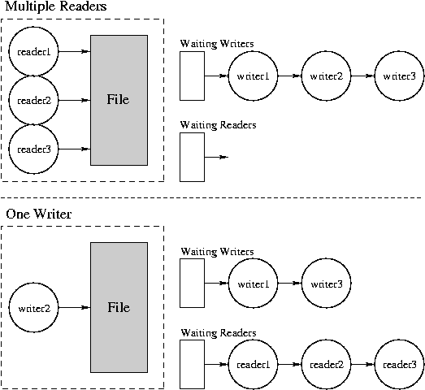

# Semaphore Example: Readers and Writers

* * *

OSTEP: Chapters 31

Semaphore usage generally falls into two classes:

1. Uniform resource usage, simple first-in-first-out scheduling:
   use semaphores for everything. This is usually the case.
   Use one semaphore for each constraint in the system.

2. More complex patterns of resource usage: interaction between
   different users of a resource, or changing priorities: semaphores
   cannot capture the scheduling all by themselves. Must use
   _state variables_ to record information about priorites,
   resource state. In this case, semaphores get used for two things:


   - One semaphore for mutual exclusion on the state variables.

   - One semaphore for each class of waiting; used just as a convenience
     to make a process wait. In the worst case, one semaphore per
     process.


Whenever possible, cast problems into the first class. This
usually can be done.

Unfortunately, sometimes a resource is shared by
different _classes_ of
users; that is, they use the resource in different ways.
Potentially the different kinds of usage interact. For example,
consider a shared database with readers and writers. It is safe
for any number of readers to access the database simultaneously,
but each writer must have exclusive access. Example: checking
account (statement-generators are readers, tellers are writers).

   - Note that writers are actually readers too.

   - In this case, the constraints are too complicated to be
     solved single-handedly with semaphores.

   - Constraints:
     - Readers can only proceed if there are no
       active or waiting writers (use semaphore OKToRead).

     - Writers can only proceed if there are no
       active readers or writers (use semaphore OKToWrite).

     - Only one process may manipulate internal
       state variables at once (use semaphore Lock).
   - Scheduling: writers get preference.

   - State variables:


     - AR = number of active readers.

     - WR = number of waiting readers.

     - AW = number of active writers.

     - WW = number of waiting writers.


AW is always 0 or 1.
AR and AW may not both be non-zero.

   - Initialization:
     - `
       semaphore OKToRead (0);
       `
     - `
       semaphore OKToWrite semaphore(0);
       `
     - `
       semaphore Lock = semaphore(1);
       `
     - `
       volatile int AR = 0, WR = 0, AW = 0, WW = 0;
       `

**Reader Process:****Writer Process:**

```

  StartRead ()
  {
     P(Lock);
     if ((AW+WW) != 0) {
        WR++;
        V(Lock);
        P(OKToRead);
     } else  {
        AR++;
        V(Lock);
     }
  }

```

```

  StartWrite ()
  {
     P(Lock);
     if ((AW+AR+WW) != 0) {
        WW++;
        V(Lock);
        P(OKToWrite);
     } else  {
        AW++;
        V(Lock);
     }
  }

```

```

EndRead ()
  {
     P(Lock);
     AR--;
     if ((AR == 0) and (WW > 0)) {
        V(OKToWrite);
        AW++;
        WW--;
     }
     V(Lock);
  }

```

```

  EndWrite ()
     P(Lock);
     AW--;
     if (WW>0) {
        V(OKToWrite);
        AW++;
        WW--;
     } else {
        while (WR>0) {
           V(OKToRead);
           AR++;
           WR--;
        }
     }
     V(Lock);
  }

```

```

  main ()
  {
     StartRead();
     // --read the necessary data--
     EndRead();
  }

```

```

  main ()
  {
     StartWrite();
     // --write the necessary data--
     EndWrite();
  }

```

Examples:

   - Reader enters and leaves system.

   - Writer enters and leaves system.

   - Two readers enter system.

   - Writer enters system and waits.

   - Reader enters system and waits.

   - Readers leave system, writer continues.

   - Writer leaves system, last reader continues and leaves.




Questions:

   - In case of conflict between readers and writers, who
     gets priority?

   - Is the WW necessary in the writer's first if?

   - Can OKToRead ever get greater than 1? What about OKToWrite?

   - Is the first writer to execute Lock.P() guaranteed to be
     the first writer to access the data?


* * *

Copyright © 2013, 2018 Barton P. Miller

Non-University of Wisconsin students and teachers are welcome
to print these notes their personal use.
Further reproduction requires permission of the author.

