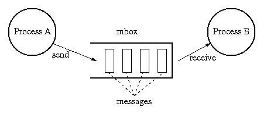
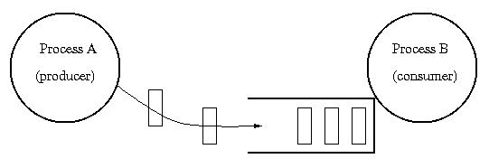
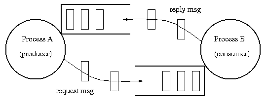

# Message Systems

* * *

Nothing in OSTEP on this topic.
There is coverage of this topic in
in Silberschatz's **Operating Systems Concepts**,
Chapter 3, Sections 3.4.2 and pages 148-150

Up until now, discussion has been about communication
using shared data. _Messages_ provide for communication
without shared data. One process or the other owns the data,
never two at the same time.

This kinds of communication is used heavily in the parallel programming
community (with
[MPI](http://www.mcs.anl.gov/mpi/index.html)).

Message = a piece of information that is passed from
one process to another.

Mailbox = a place where messages are stored between the
time they are sent and the time they are received.

Operations:

- Send: place a message in a mailbox. If the
  mailbox is full, wait until there is enough space in
  the mailbox.

- Receive: remove a message from a mailbox. If
  the mailbox is empty, then wait until a message is placed
  in it.




_Is there really no shared data?_

There are two general _styles_ of message communication:

- 1-way: messages flow in a single direction (Unix pipes,
  or producer/consumer):


  

- 2-way: messages flow in circles (remote procedure call,
  or client/server):


  


## Producer & consumer example:

**Producer****Consumer**

```
int buffer1[1000];

while (1) {

    -- prepare buffer1 --
    mbox.send(buffer1);

};

```

```
int buffer2[1000];

while (1) {

    mbox.receive(buffer2);
    -- process buffer2 --

};

```

Note that buffer recycling is implicit, whereas it was explicit in
the semaphore implementation.

## Client & Server example:

**Client****Server**

```
int buffer1[1000];

mbox1.send("read rutabaga");
mbox2.receive(buffer);

```

```
int buffer2[1000];
int command[1000];

mbox1.receive(command);
-- decode command --
-- read file into buffer2 --
mbox2.send(buffer2);

```

Note that this looks a lot like a procedure call and return.
Explain the various analogs between procedure calls and
message operations:

- Parameters:

- Result:

- Name of procedure:

- Return address:


Why use messages?

- Many kinds of applications fit into the model of
  processing a sequential flow of information, including
  all of the Unix filters.

- The component parties can be totally separate,
  except for the mailbox:
  - Less error-prone, because no invisible side effects: no
    process has access to another's memory.

  - They might not trust each other (OS vs. user).

  - They might have been written at different times
    by different programmers who knew nothing about each other.

  - They might be running on different processors
    on a network, so procedure calls are out of the question.

Which is more powerful, messages or monitors?

Message systems vary along several dimensions:

- Relationship between mailboxes and processes:
  - One mailbox per process, use process name
    in send and receive (simple but restrictive).

  - No strict mailbox-process association, use
    mailbox name (can have multiple mailboxes per process,
    can pass mailboxes from process to process, but trickier
    to implement) \[Unix\].
- Extent of buffering:
  - Buffering (more efficient for large transfers
    when sender and receiver run at varying speeds).

  - None -- rendezvous protocols (simple, OK for
    call-return type communication, know that message was
    received).
- Conditional vs. unconditional ops:
  - Unconditional receive: return message if mailbox is not empty, otherwise
    wait until message arrives.

  - Conditional receive: return message if mailbox is not empty, otherwise
    return special "empty" value.

  - Unconditional send: wait until mailbox has space.

  - Conditional send: return "full" if no space in mailbox (message
    is discarded).


    What happens with rendezvous protocols and conditional operations?
- Additional forms of waiting:
  - Almost all systems allow many processes to wait on the same
    mailbox at the same time. Messages get passed to processes
    in order.

  - A few systems allow each process to wait on several mailboxes
    at once. The process gets the first message to arrive
    on any of the mailboxes. This is actually quite useful (give Caesar as an
    example).
- Constraints on what gets passed in messages:
  - None: just a stream of bytes (Unix pipes).

  - Enforce message boundaries (send and receive
    in same chunks).

  - Protected objects (e.g. a token for a mailbox).

How would the following systems fall into the above classifications?

- Condition variables

- Unix pipes


* * *

Copyright © 2013, 2018 Barton P. Miller

Non-University of Wisconsin students and teachers are welcome
to print these notes their personal use.
Further reproduction requires permission of the author.

